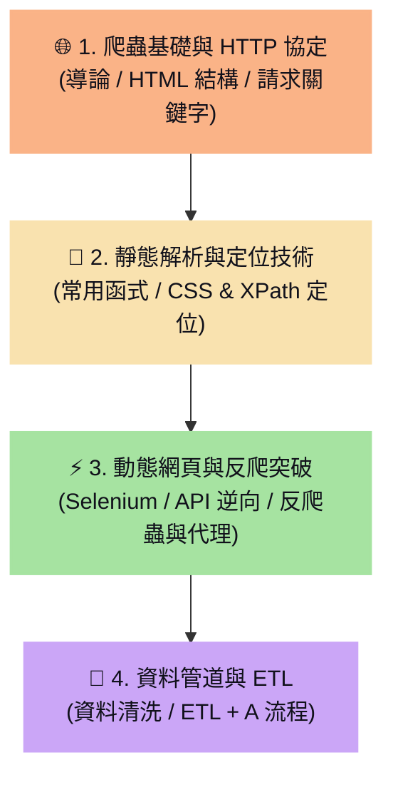

# 🗺️ 網路爬蟲學習地圖 

> [!ABSTRACT]
> 本章為網路爬蟲技術的學習地圖，涵蓋了從 HTTP 協定基礎、HTML 結構解析、定位器語法，到動態 JavaScript 網頁爬取、反爬蟲防禦突破，以及資料管道清洗（ETL）的完整實務與學習路徑。

---

歡迎使用網路爬蟲知識庫學習地圖。本首頁旨在將 8 篇學習筆記進行系統化的分類與路徑引導，協助開發者從零建構高效、穩健的自動化網頁數據採集系統。

---

## 🧭 學習路徑導覽

---

## 🌐 1. 爬蟲基礎與 HTTP 協定

掌握網頁運作的基本原理與 HTTP 通訊協定，這是模擬瀏覽器行為的基礎。
- **[[1. 導論]]**：爬蟲運作流程、常用應用情境，以及靜態網頁與動態網頁在抓取策略上的本質差異。
- **[[2. HTML Basic]]**：HTML 標籤、屬性（id / class）、巢狀 DOM 結構，以及如何透過瀏覽器開發者工具檢視原始碼。
- **[[3. Key word]]**：HTTP 請求標頭（User-Agent、Referer）、Cookie 驗證機制、Payload 資料傳遞，與 GET/POST 請求方法。

---

## 📐 2. 靜態解析與定位技術

學習如何快速請求靜態網頁原始碼，並使用強大的定位器精準提取所需的欄位資料。
- **[[4. 網路爬蟲常用函式]]**：`requests` 發送 HTTP 請求與取得狀態碼，以及 `BeautifulSoup` 進行基礎 DOM 節點搜尋。
- **[[8. 網頁定位解析速查 (CSS Selector & XPath)]]**：CSS 選擇器與 XPath 語法對照、BeautifulSoup 的 `select()` 語法，以及 `lxml` 庫的高效率節點精確定位。

---

## ⚡ 3. 動態網頁與反爬突破

面對現代 JavaScript 渲染網頁與防爬機制，採取自動化工具與策略性規避來確保爬蟲的穩定度。
- **[[6. 動態網頁爬取 (Selenium & API 偵測)]]**：靜態與動態渲染的差異、Network 面板 API 逆向工程分析，以及 Selenium 的自動化操控與動態資料抓取。
- **[[7. 反爬蟲突破與防禦策略]]**：IP 封鎖防範、User-Agent 隨機輪替、IP 代理池（Proxies）整合、頻率限制（Rate Limiting）與隨機延遲策略。

---

## 🧹 4. 資料管道與 ETL

將抓取到的混亂原始資料轉換為乾淨、結構化的格式，並儲存至檔案或資料庫。
- **[[5. 資料清洗Data Pipeline]]**：資料工程中的 ETL（Extract, Transform, Load）架構、資料清理與欄位格式化，以及自動化 Pipeline 的建構。

---

## 💡 Obsidian 檢索小提示
- 在本學習地圖的雙向連結上按下 `Ctrl + 點擊`，可直接在新分頁開啟對應的筆記。
- 搭配左側的 Outline 面板，能在 **基礎協定 / 靜態解析 / 動態反爬 / 資料清洗** 之間秒速導航定位！
