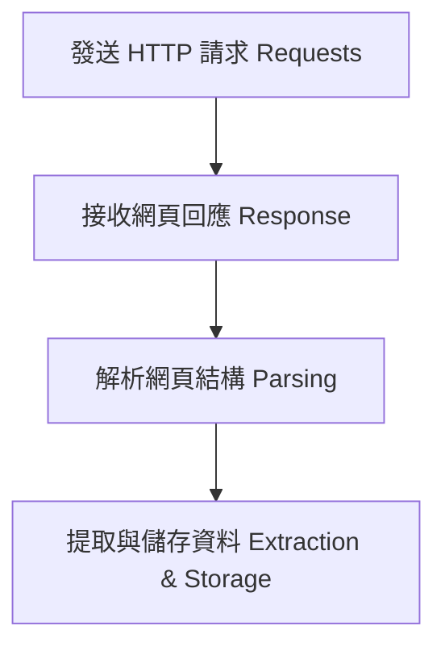

# 1. 網路爬蟲導論

> [!ABSTRACT]
> 本章介紹網路爬蟲的基本觀念、運作流程、常見應用情境，以及靜態網頁與動態網頁在爬取方法上的差異。

---

## 一、 什麼是網路爬蟲？
網路爬蟲（Web Crawler）是一種使用代碼自動化模擬瀏覽器行為，從網際網路上抓取特定網頁資料並進行儲存與分析的技術。

### 常見應用情境
- **搜尋引擎索引 (Search Engine Indexing)**：如 Google、Bing 爬取全球網頁以建立搜尋索引。
- **新聞與輿情蒐集**：定時蒐集各大新聞網站與社群媒體的文章與討論。
- **比價與市調**：監控電商網站（如 PChome、蝦皮）的商品價格與庫存。
- **求職資訊整合**：從 104、109 等求職平台整合職缺資訊。
- **金融與投資分析**：爬取股市行情、財報等公開數據進行量化分析。

---

## 二、 網路爬蟲的運作原理
網路爬蟲的核心是模擬使用者的瀏覽器行為，主要包含以下四個步驟：

1. **發送請求 (Request)**：爬蟲程式向目標伺服器發送 HTTP 請求（例如 `GET`），請求特定的網頁 URL。
2. **接收回應 (Response)**：伺服器處理後，回傳 HTML 網頁原始碼、JSON 資料或 XML 檔案。
3. **解析結構 (Parsing)**：使用解析器（如 BeautifulSoup 或 lxml）解析回傳的資料結構。
4. **提取與儲存 (Extraction & Storage)**：提取所需的關鍵資料，進行資料清洗，最後存入資料庫或本機檔案（如 CSV、Excel）。

---

## 三、 靜態網頁與動態網頁的爬取策略

在開發爬蟲時，必須區分目標網頁是靜態頁面還是動態頁面，這決定了我們要使用的工具與方法：

| 網頁類型                    | 特點說明                                               | 常用爬取方法                                                                               |
| :---------------------- | :------------------------------------------------- | :----------------------------------------------------------------------------------- |
| **靜態網頁 (Static Page)**  | 資料直接嵌入在伺服器回傳的 HTML 原始碼中，一次載入完成。                    | 使用 `requests` 發送請求，再用 `BeautifulSoup` 進行 HTML 解析。                                    |
| **動態網頁 (Dynamic Page)** | 網頁基本框架先載入，資料則是透過 JavaScript 異步（AJAX）向 API 請求後動態渲染。 | 1. 透過瀏覽器開發者工具尋找並直接爬取 API 介面（推薦，速度快）。 2. 使用 `Selenium` 或 `Playwright` 模擬瀏覽器進行動態渲染。 |

---

## 四、 常用爬蟲套件與函式庫

在 Python 生態系中，有許多強大且成熟的套件：

- **`requests`**：最受歡迎的 HTTP 請求庫，用於發送 GET、POST 請求。
- **`BeautifulSoup4`**：功能強大的 HTML/XML 解析庫，支援 CSS 選擇器，便於快速尋找標籤。
- **`lxml`**：高效能的 HTML 解析引擎，通常作為 BeautifulSoup 的底層解析器.
- **`selenium`**：網頁自動化測試工具，可用於模擬真實瀏覽器操作以處理複雜的動態網頁與驗證碼。
- **`pandas`**：用於整理、清洗與儲存結構化資料的數據分析工具。
- **`re` (正規表示式)**：內建的文字處理庫，用於進行複雜的字串匹配與特徵提取。

---

## 五、 相關連結
- 關連筆記：[[2. HTML Basic]] | [[3. Key word]] | [[4. 網路爬蟲常用函式]]
