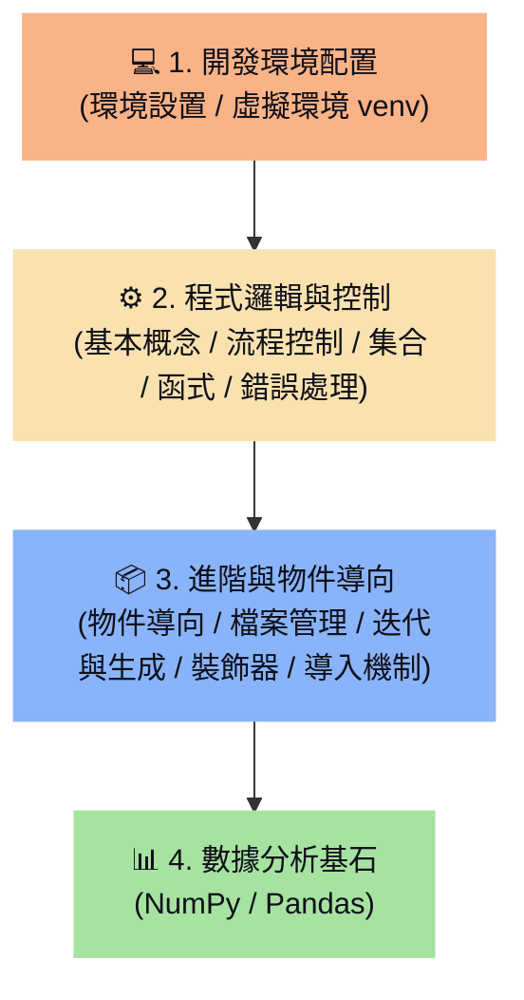

# 🗺️ Python 語言基礎學習地圖 (Python Basics Learning Map)

> [!ABSTRACT]
> 本章為 Python 語言基礎的學習地圖，涵蓋了從本機環境配置、虛擬環境 venv 建立、基本語法與流程控制，到進階物件導向（OOP）、迭代與生成器、模組包導入，以及強大的 NumPy 與 Pandas 數據分析庫之完整學習路徑。

---

歡迎使用 Python 語言基礎知識庫學習地圖。本首頁採用程式開發與數據分析的核心範疇，將 15 篇學習筆記進行了系統化的歸納與分類，方便您在學習與開發時快速查找對應的語法與觀念。

---

## 🧭 學習路徑導覽

---

## 💻 1. 開發環境配置

建置一個乾淨、隔離的 Python 開發環境，避免第三方套件版本衝突。
- **[[1.介紹與環境設置]]**：Python 直譯器安裝、環境變數 PATH 配置與 VS Code/PyCharm 開發工具設置。
- **[[2.設定虛擬環境 venv]]**：自訂虛擬環境 `venv` 的建立、啟用（Activate）、停用（Deactivate）及使用 pip 管理套件封裝。

---

## ⚙️ 2. 程式邏輯與控制

掌握程式設計的核心基石，包含流程分歧、資料容器與函數封裝。
- **[[3.基本概論]]**：變數宣告命名、四則運算子與基本資料型態（數值、字串、布林）。
- **[[4. 流程控制]]**：條件判斷（`if-elif-else`）、`for` 迴圈遍歷、`while` 條件迴圈與 `break/continue` 控制。
- **[[5. 集合(清單與字典)]]**：列表（List）、元組（Tuple）、集合（Set）與字典（Dictionary）的核心操作與生成式語法。
- **[[6. 函式]]**：自訂函式結構（`def`）、參數預設值、任意長度引數（`*args`, `**kwargs`）與返回值設計。
- **[[9. 執⾏錯誤處理]]**：異常處理機制（`try-except-finally`）、異常類別捕獲與使用 `raise` 拋出錯誤。

---

## 📦 3. 進階與物件導向程式設計

進入進階程式架構，學習程式碼重用、記憶體優化與中大型專案架構設計。
- **[[7. 物件導向]]**：類別（Class）與物件（Object）、屬性與方法、構造函數 `__init__`、封裝、繼承與多型。
- **[[8. 常⽤資料處理函式]]**：高階函數應用，包含匿名函式 `lambda`、`map` 轉換、`filter` 過濾以及 `reduce` 歸納。
- **[[10. 本機檔案管理]]**：利用 Python 讀取、寫入與追加文字檔案，以及使用 `os` 模組進行目錄與路徑管理。
- **[[13. 迭代器與生成器 (yield)]]**：迭代器協議、生成器定義（`yield` 暫停掛起機制）、生成器與列表內存開銷對照，以及超大數據流式檔案讀取。
- **[[14. 裝飾器 (Decorator)]]**：函式一等公民與閉包觀念、`@decorator` 語法糖、`functools.wraps` 元數據保存與函式執行時間計算實戰。
- **[[15. 模組與套件導入機制]]**：模組包結構（`__init__.py` 初始化）、絕對導入與相對導入規範、`sys.path` 導入路徑搜尋與導包報錯排除。
- **[[16. 併發程式設計基礎]]**：併發與並行的本質差異、GIL 全域鎖限制、多執行緒與多處理序選用，以及協程（Asyncio）基礎概念。

---

## 📊 4. 數據分析基石

為人工智慧、機器學習與文字探勘打下堅實的數據底層基礎。
- **[[11.NumPy]]**：科學計算庫。Ndarray 陣列建立、多維陣列切片、矩陣數學運算與廣播機制（Broadcasting）。
- **[[12. Pandas]]**：數據分析庫。Series 一維與 DataFrame 二維資料結構、資料篩選過濾、遺失值處理（NAN）與基本統計運算。

---

## 💡 Obsidian 檢索小提示
- 在本學習地圖的雙向連結上按下 `Ctrl + 點擊`，可直接在新分頁開啟對應的筆記。
- 善用左側的大綱導航面板 (Outline)，可在 **環境配置 / 程式邏輯 / 進階與物件導向 / 數據分析** 大分類之間秒速定位！