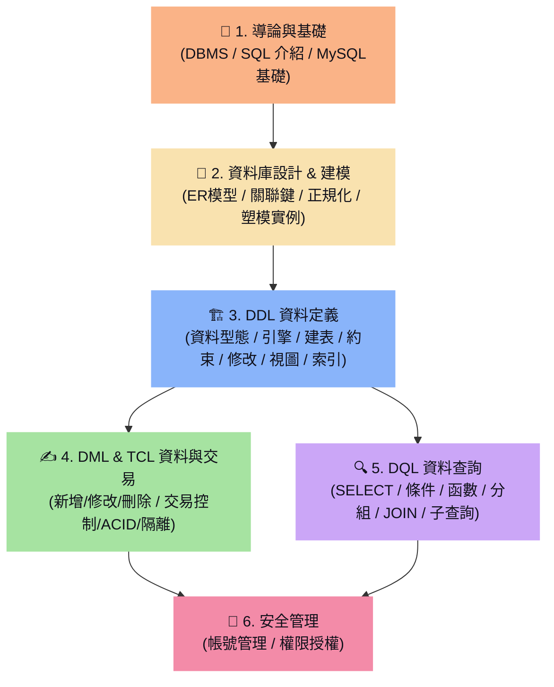

# 🗺️ MySQL 學習地圖 (MySQL Learning Map)

> [!ABSTRACT]
> 學習關聯式資料庫的學習地圖，涵蓋從基礎 SQL 查詢、資料庫設計、索引優化到交易控制的完整學習路徑。

---

歡迎使用 MySQL 知識庫學習地圖。本首頁採用 SQL 核心知識範疇對 21 篇學習筆記進行了系統化的歸納與分類，方便您在學習與開發時快速查找對應的語法與觀念。

---

## 🧭 學習路徑導覽

---

## 🏁 1. 導論與基礎概念

進入 SQL 世界的起點，了解資料庫環境與基本連線操作。
- **前置觀念（跨目錄連結）：**
  - **[[1. 資料庫管理系統(DBMS)介紹]]**：了解何謂 DBMS、關聯式與非關聯式資料庫的差異。
  - **[[2. SQL 介紹]]**：SQL 的分類（DQL, DML, DDL, DCL, TCL）與基本語法特性。
- **MySQL 入門：**
  - **[[1. MySQL基礎介紹]]**：MySQL 登入與退出、基本資料庫管理命令與環境介紹。

---

## 🎨 2. 資料庫設計與關係模型塑模 (Database Design & Modeling)

> [!NOTE]
> **資料庫設計核心特點：**
> - 在實作建表前，必須先規劃資料的結構、關係與限制，避免資料冗餘與更新異常。
> - 主要步驟：需求分析 ➔ 概念設計 (ERD) ➔ 邏輯設計 (關係模型 & 正規化) ➔ 實體設計 (DDL)。

- **[[18. 資料庫設計概念]]**：資料庫設計的 4 大步驟、ER模型（實體、屬性、關係與確認關係）基礎觀念。
- **[[19. 常見ER模型表示法]]**：使用 UML 類別圖表達 ER 模型、基數（Cardinality）推導與多對多結合實體（Associative Entity）處理。
- **[[20. 關聯模型基本概念]]**：超鍵、候選鍵、主鍵、次要鍵與外來鍵（5 大鍵）、五大完整性限制，以及功能相依（完全、部分、遞移相依）觀念。
- **[[21. 正規化]]**：正規化的目的與代價、第一正規化 (1NF)、第二正規化 (2NF)、第三正規化 (3NF) 與反正規化（De-normalization）決策。
- **[[22. 關聯式資料塑模]]**：完整顧問公司專案實例，示範從實體選定、關係對應、畫出 ER 圖、解決多對多、正規化到 SQL 表格產生的完整設計流程。

---

## 🏗️ 3. DDL (Data Definition Language - 資料定義語言)

> [!WARNING]
> **DDL 核心特點：**
> - 主要指令：`CREATE`、`ALTER`、`DROP`、`RENAME`。
> - 用於定義、修改與刪除資料庫及資料表的**「結構定義與物件」**。
> - ==**在 MySQL 中，DDL 執行即隱式提交，絕對不能被回滾 (Cannot Rollback)！**==

### 3.1 資料定義基礎與建表
- **[[4. 資料型態]]**：建表必備基礎，收錄數值型、字串型、日期時間型態（對比 `DATETIME` 與 `TIMESTAMP` 時區影響與空間大小）。
- **[[11. 資料庫引擎(Engine)]]**：MyISAM、InnoDB 與 MEMORY 儲存引擎實體結構與限制對比，以及字元編碼字元集 (`utf8mb4`) 與定序排序規則 (`Collation`) 設定。
- **[[12. 新建資料表]]**：`CREATE TABLE` 基礎語法與命名規範、`IF NOT EXISTS` 判斷、使用 `CTAS (AS SELECT)` 與 `LIKE` 複製表格結構、`Generated Column` (衍生欄位) 與 `ENUM` (列舉型態) 設定。

### 3.2 結構修改與約束管理
- **[[13. 資料檢查條件(Constraints)]]**：欄位與資料表階層限制條件定義。收錄 `DEFAULT` 預設值、`NOT NULL`、主鍵（`PRIMARY KEY`）、唯一鍵（`UNIQUE`）、自動編號（`AUTO_INCREMENT`）機制、外來鍵（`FOREIGN KEY`）級聯刪除更新 (`CASCADE` / `SET NULL`) 聯動規則，以及自訂的 `CHECK` 資料檢測。
- **[[14. 修改資料表結構(Alter)]]**：`ALTER TABLE` 動態管理，包括欄位的新增 (`ADD`)、修改 (`MODIFY` / `CHANGE`)、刪除 (`DROP`)，主外鍵約束之動態增刪，以及資料表重新命名。

### 3.3 高級資料庫定義物件
- **[[15. 視觀表(view)]]**：虛擬資料表定義。詳細歸納簡單與複雜 View 的 DML 更新限制條件、唯讀保護，以及 `WITH CHECK OPTION` 選項之寫入限制防護。
- **[[16. 索引Index]]**：提升檢索效能的底層結構。詳解全表掃描 (Table Scan) 與索引掃描、B-Tree 樹狀結構、叢集索引 (Clustered Index) 與非叢集索引的儲存定位差異，以及 PK/UK/FK 與自動索引的聯動生命週期。

---

## ✍️ 4. DML & TCL (資料處理與交易控制語言)

> [!IMPORTANT]
> **DML & TCL 核心特點：**
> - 主要指令：`INSERT`、`UPDATE`、`DELETE` 及 `COMMIT`、`ROLLBACK`。
> - 用於變更資料表中的**實體資料記錄**。
> - ==**在 MySQL 中，DML 的變更是可以透過交易控制進行回滾 (Rollback) 的。**==

- **[[9. 資料處理語言]]**：
  - **`INSERT`**：單筆/多筆新增、子查詢複製新增，以及 NOT NULL、型態不符等常見錯誤預防。
  - **`UPDATE`**：資料修改與安全更新模式 (`SQL_SAFE_UPDATES`) 規範。
  - **`DELETE`**：實體資料刪除與約束衝突說明。
- **[[10. 資料庫交易(Transactions)]]**：
  - 交易的核心 **ACID** 四大特性（原子性、一致性、隔離性、持久性）。
  - 自動與手動交易控制（`@@AUTOCOMMIT`）、自訂交易區塊 (`START TRANSACTION`)。
  - 交易進行中的**列鎖定 (Row Locking)** 與資料未提交狀態能見度。
  - 交易儲存點 (**`SAVEPOINT`**) 部分回滾機制。
  - 多人併發交易衝突（髒讀、更新遺失、不可重複讀、幻讀）與 SQL 四大**隔離級別 (Isolation Levels)** 的安全與效能折衷。

---

## 🔍 5. DQL (Data Query Language - 資料查詢語言)

> [!NOTE]
> **DQL 核心特點：**
> - 主要指令：`SELECT`。
> - 用於從資料表中檢索、過濾、關聯與計算資料，屬於**唯讀操作**，不改變實體資料結構與記錄。

- **[[2. SELECT 語法]]**：基礎查詢結構、欄位別名、`CONCAT` 字串串接與 `LIMIT` 筆數限制。
- **[[3. 條件查詢(where)]]**：`WHERE` 篩選條件、比較與邏輯運算子、`LIKE` 模糊比對、`ORDER BY` 排序與 `CASE` 流程控制。
- **[[5. 函數]]**：單行函數（字串、數值、日期時間、流程控制）與多行統計聚合函數（`SUM`、`AVG`、`COUNT` 等）。
- **[[6. 資料分組(Grouping Data)]]**：使用 `GROUP BY` 進行資料分組、`GROUP_CONCAT` 合併字串，以及使用 `HAVING` 對分組結果進行二次過濾（詳解 `WHERE` 與 `HAVING` 的執行順序差異）。
- **[[7. 多表格查詢(join)]]**：跨表格關聯查詢，包含 Cross Join、Inner Join、Outer Join（左外、右外連接）、Self Join（自我連接）及 `UNION` 聯集操作。
- **[[8. 子查詢(Sub-Queries)]]**：巢狀查詢技術，解析單行、多行、多欄、表值子查詢，關聯與非關聯子查詢之區別，以及高效的 `EXISTS` 與 `NOT EXISTS` 判斷。

---

## 🔑 6. 資料庫安全管理

> [!IMPORTANT]
> **資料庫安全核心特點：**
> - 主要指令：`CREATE USER`、`GRANT`。
> - 用於設定資料庫系統層級連線許可（系統安全）與使用者對物件的存取方式（資料安全）。

- **[[17. 資料庫安全]]**：使用者帳號管理、帳號驗證分層字典表（`user`, `db` 等）、`GRANT` 授權指令及系統與物件權限明細對照表。

---

## 💡 Obsidian 檢索小提示
- 在本學習地圖的雙向連結上按下 `Ctrl + 點擊`，可直接在新分頁開啟對應的筆記。
- 善用左側的大綱導航面板 (Outline)，可在 **DQL / DML / DDL / 設計與建模 / 安全管理** 大分類之間秒速切換定位！
