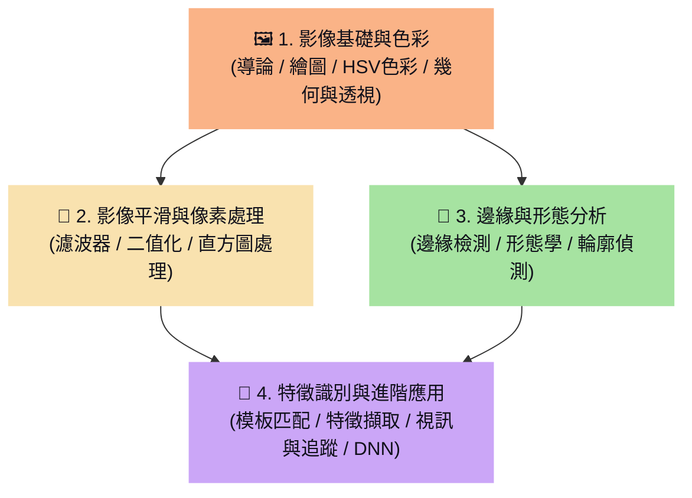

# 🗺️ OpenCV 學習地圖 (OpenCV Learning Map)

> [!ABSTRACT]
> 本章為 OpenCV 影像處理的學習地圖，涵蓋了從基本影像矩陣讀寫、色彩空間變換、濾波與形態學分析，到高階的特徵檢測、視訊物體追蹤以及深度學習（DNN）模組載入的完整實務與學習路徑。

---

歡迎使用 OpenCV 知識庫學習地圖。本首頁採用電腦視覺核心範疇，將 18 篇學習筆記進行了系統化的歸納與分類，方便您在學習與開發時快速查找對應的影像處理語法與觀念。

---

## 🧭 學習路徑導覽

---

## 🖼️ 1. 影像基礎與色彩空間

掌握影像在電腦中的矩陣儲存結構（NumPy），以及基本圖像繪製與幾何變換。
- **[[1.導論]]**：影像色彩模型（BGR與灰階）、影像矩陣讀取/寫入、NumPy 像素點切片操作與通道分離。
- **[[2.OpenCV 繪圖]]**：繪製直線、矩形、圓形與多邊形、影像混色加權與滑鼠/滾動條互動控制。
- **[[3. 色彩空間(HSV)]]**：HSV 色彩空間的色調/飽和度/亮度定義、特定顏色遮罩（Mask）的提取。
- **[[4. 圖片幾何轉換]]**：影像的縮放、平移與仿射變換（旋轉與剪切）矩陣計算。
- **[[15. 透視變換與影像校正]]**：透視變換原理、四點透視矩陣計算與傾斜文件/車牌拉直校正實戰。

---

## 🧼 2. 影像平滑與像素處理

了解如何進行雜訊消除、影像加強，以及自動化二值化提取特徵的前置處理。
- **[[5. 濾波器]]**：影像邊界填充（Padding）、均值/方框/高斯濾波防模糊，以及雙邊與中值濾波去噪。
- **[[6.設定值處理]]**：簡單二值化、自適應閾值處理（解決光照不均），以及雙峰分佈下的 **Otsu 自動閾值選擇**。
- **[[12. 直方圖處理]]**：直方圖計算與繪製、直方圖均衡化（提升對比度），以及局部對比度受限自適應均衡化（CLAHE）的應用。

---

## 📐 3. 邊緣與形態分析

提取物體結構的邊緣特徵，並透過形態學運算修復圖像瑕疵與輪廓追蹤。
- **[[7. 邊緣檢測]]**：Sobel 與 Scharr 差分算子、拉普拉斯算子與 Canny 高精確度邊緣檢測演算法。
- **[[9. 形態學]]**：膨脹與侵蝕、開運算（去噪）與閉運算（填孔），以及禮帽與黑帽運算。
- **[[8.輪廓偵測 (contours)]]**：邊緣外接矩形、外接圓形、極值點與輪廓面積/周長等幾何特徵提取。
- **[[16. 進階影像分割與去背]]**：分水嶺演算法（Watershed）解決硬幣/細胞粘連問題，以及 **GrabCut 交互式前景去背** 實戰。

---

## 🚀 4. 特徵識別與進階應用

進行影像間的特徵點匹配、動態視訊分析，並銜接現代深度學習推論模型。
- **[[10. 影像模板匹配]]**：模板匹配的運作原理、多模板匹配與最大值定位。
- **[[11. 特徵擷取]]**：Harris 角點檢測、尺度不變特徵轉換（SIFT）、ORB 快速局部特徵提取與 Brute-Force 特徵點匹配。
- **[[13. 視訊處理]]**：讀取外部視訊檔、捕捉攝影機串流、視訊存檔與寫入設定。
- **[[17. 移動偵測與物體追蹤]]**：訊號相減與 MOG2 背景消除移動偵測、Meanshift & CamShift 直方圖物體追蹤與光流法運動估計。
- **[[14.函式庫 DLib]]**：DLib 68 點人臉關鍵特徵定位、哈爾級聯人臉偵測與 Tesseract OCR 文字辨識。
- **[[18. OpenCV 與 DNN 模組應用]]**：使用 `cv2.dnn` 加載 TensorFlow/ONNX/Caffe 模型，將影像轉換為 Blob，並執行 SSD 即時人臉偵測推理。

---

## 💡 Obsidian 檢索小提示
- 在本學習地圖的雙向連結上按下 `Ctrl + 點擊`，可直接在新分頁開啟對應的筆記。
- 善用左側的大綱導航面板 (Outline)，可在 **影像基礎 / 像素處理 / 邊緣與形態 / 特徵與進階應用** 大分類之間秒速定位！
