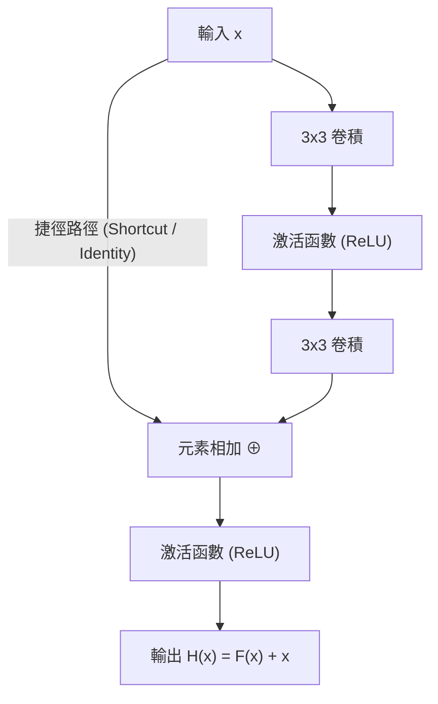

# 12. ResNet 殘差網路介紹與實作

> [!ABSTRACT]
> 本章介紹深度殘差網路（Deep Residual Network, ResNet）的核心概念。隨著神經網路深度增加，模型會面臨「梯度消失」與「退化問題（Degradation）」。ResNet 透過革命性的「捷徑連接（Shortcut Connection）」與「殘差學習（Residual Learning）」，成功訓練出深達 152 層甚至上千層的神經網路。

---

## 一、 深層網路的挑戰與退化問題

在 AlexNet (7層)、VGG (19層)、GoogLeNet (22層) 的演進中，我們知道理論上**網路越深，提取特徵的能力越強，效果應該越好**。然而，無限制加深網路會遇到兩個核心阻礙：

1. **梯度消失/爆炸**：
   - 解決方法：使用 ReLU 激活函數、權重初始化（He/Xavier）、Batch Normalization 等技術，已基本解決此問題。
2. **退化問題 (Degradation Problem)**：
   - **現象**：當網路加深到一定程度時，**訓練集**與測試集的準確率同時開始下降。這**不是過擬合（Overfitting）**造成的（因為訓練誤差也變大了），而是因為網路太深，導致優化演算法難以收斂到全局最優解。

```
[淺層網路 (準確率佳)] ➔ 堆疊更多卷積層 ➔ [深層網路 (訓練誤差反而變大，即退化問題)]
```

---

## 二、 殘差學習 (Residual Learning) 核心原理

何愷明（Kaiming He）博士提出了一個直覺的想法：**如果深層網路的後幾層能學會「恆等映射（Identity Mapping, $H(x) = x$）」，那麼深層網路的性能起碼不會比淺層網路差。**

然而，讓多個非線性卷積層去強行擬合 $H(x) = x$ 是非常困難的。

### 解決方案：重新定義擬合目標
我們不讓網路直接學習完整的映射 $H(x)$，而是將結構設計成：

$$H(x) = F(x) + x \implies F(x) = H(x) - x$$

- $x$：前一層的輸入。
- $F(x)$：**殘差映射 (Residual Mapping)**，即兩層卷積之間的差值。
- $H(x)$：最終輸出的**期望映射**。
- **優勢**：當網路退化時，模型只需將殘差 $F(x)$ 優化為 $0$，即可輕鬆實現恆等映射 $H(x) = x$。這極大地降低了優化的難度。



---

## 三、 捷徑連接 (Shortcut Connection) 的維度匹配

在進行 $F(x) + x$ 矩陣相加時，必須確保兩者的形狀（維度）一致：

### 1. 同維度投影 (恆等捷徑)
若 $F(x)$ 的輸出通道數與輸入 $x$ 相同，且特徵圖長寬不變，則直接進行**逐元素相加 (Element-wise Addition)**：
$$y = F(x, \{W_i\}) + x$$

### 2. 異維度投影
若在降採樣（Downsampling，如 Stride=2）或通道數改變的網路段中，$F(x)$ 的維度與 $x$ 不同，則必須對捷徑路徑的 $x$ 進行一次**線性投影**（透過 $1 \times 1$ 卷積）來調整維度：
$$y = F(x, \{W_i\}) + W_s x$$
- $W_s$ 為可學習的投影權重，主要用來調整 $x$ 的通道數與特徵圖尺寸以匹配 $F(x)$。

---

## 四、 兩種經典的殘差模組 (Residual Blocks)

根據網路的深度，ResNet 設計了兩種不同的殘差結構：

```
Basic Block (適用於 ResNet-18/34)
   [ 3x3 Conv ] ➔ [ 3x3 Conv ]

Bottleneck Block (適用於 ResNet-50/101/152)
   [ 1x1 Conv (降維) ] ➔ [ 3x3 Conv ] ➔ [ 1x1 Conv (升維) ]
```

### 1. 基本殘差塊 (Basic Block)
- **結構**：由兩個 $3 \times 3$ 卷積層組成。
- **參數量計算**（假設輸入/輸出通道數皆為 256）：
  $$\text{Parameters} = 3 \times 3 \times 256 \times 256 \times 2 = 1,179,648$$

### 2. 瓶頸殘差塊 (Bottleneck Block)
- **結構**：先用 $1 \times 1$ 卷積降維，再進行 $3 \times 3$ 卷積，最後用 $1 \times 1$ 卷積復原通道數（升維）。
- **參數量計算**（同樣輸入/輸出通道數為 256，中間降維至 64）：
  $$\text{Parameters} = (1 \times 1 \times 256 \times 64) + (3 \times 3 \times 64 \times 64) + (1 \times 1 \times 64 \times 256) = 69,632$$
- **優勢**：**參數量降低了約 17 倍**！這使得我們可以疊加更多層數（如 152 層）而不會超出運算限制。

---

## 五、 TensorFlow Keras 實作

以下展示如何使用 Keras Functional API 實作一個標準的 `BasicBlock` 殘差模組（包含維度不匹配時的自動投影處理）：

```python
"""
File: resnet_basic_block.py
Description: 使用 TensorFlow Keras Functional API 實作 ResNet 殘差模組 (BasicBlock)
"""
import tensorflow as tf
from tensorflow.keras import layers

def residual_block(input_tensor, filters, stride=1):
    """
    建立一個 BasicBlock 殘差塊
    :param input_tensor: 輸入張量
    :param filters: 卷積核個數 (輸出通道數)
    :param stride: 步長，若大於 1 則進行降採樣
    """
    # 1. 主路徑 (Residual Mapping)
    x = layers.Conv2D(filters, (3, 3), strides=stride, padding='same')(input_tensor)
    x = layers.BatchNormalization()(x)
    x = layers.Activation('relu')(x)
    
    x = layers.Conv2D(filters, (3, 3), strides=1, padding='same')(x)
    x = layers.BatchNormalization()(x)
    
    # 2. 捷徑路徑 (Shortcut / Identity Mapping)
    shortcut = input_tensor
    
    # 如果步長不為 1 (特徵圖長寬改變) 或輸入輸出通道數不同，則使用 1x1 卷積進行投影維度對齊
    if stride != 1 or input_tensor.shape[-1] != filters:
        shortcut = layers.Conv2D(filters, (1, 1), strides=stride, padding='same')(input_tensor)
        shortcut = layers.BatchNormalization()(shortcut)
        
    # 3. 元素相加 (F(x) + x) 與最終的激活函數
    x = layers.add([x, shortcut])
    x = layers.Activation('relu')(x)
    return x

# 驗證實作：建立輸入張量並通過殘差塊
input_shape = (56, 56, 64)
inputs = layers.Input(shape=input_shape)
outputs = residual_block(inputs, filters=128, stride=2) # 降採樣，通道翻倍

model = tf.keras.Model(inputs=inputs, outputs=outputs)
model.summary()
```

---

## 六、 相關連結
- [[11.GoogLeNet網路]]：回顧 Inception 模組如何以並聯方式加寬網路。
- [[13.預訓練模型、遷移學習]]：學習如何直接利用預訓練好的經典 CNN 架構。
