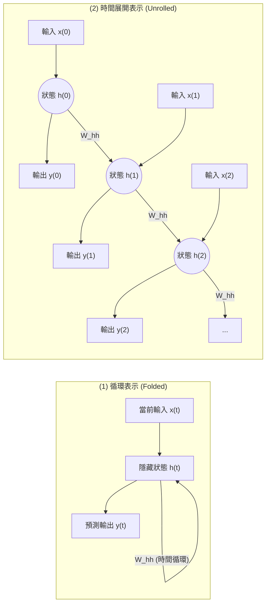

# 15. RNN 循環神經網路介紹

> [!ABSTRACT]
> 本章介紹循環神經網路（Recurrent Neural Network, RNN）的理論基礎與架構設計。相較於 CNN/DNN 無法處理具有時間前後關聯的序列數據，RNN 引入了隱藏狀態（Hidden State）作為「記憶（Memory）機制」，能有效處理自然語言、語音與時間序列。本章亦會解析 TensorFlow 中的 SimpleRNNCell 與 SimpleRNN，並提供 IMDB 情感分析實戰。

---

## 一、 為什麼需要循環神經網路 (RNN)？

傳統的卷積神經網路（CNN）與全連接網路（DNN）在處理資料時，皆假定**輸入資料之間是獨立無關的**。然而，現實生活中有許多與「時間、順序」高度相關的序列數據（Sequence Data），例如：
- **自然語言處理 (NLP)**：詞語的意思取決於上下文（例如 "bank" 在 "river bank" 與 "bank account" 中意圖不同）。
- **語音識別 (Speech Recognition)**：一段音訊的前後音節高度關聯。
- **時間序列預測**：股票走勢、氣溫變化。

### RNN 的核心思想：記憶機制
為了處理序列，下一個時刻的輸出必須結合「當前輸入」與「上一時刻的狀態」。RNN 通過在網路中引入**循環連接**，讓資訊能夠在時間步（Time Steps）之間傳遞，從而獲得「記住先前事件」的能力。

---

## 二、 RNN 基礎架構與數學原理

### 1. 網路展開示意圖
下圖展示了 RNN 在時間維度上的「折疊/循環」與「展開（Unrolled）」結構：



### 2. 數學公式
在每個時間步 $t$，狀態張量（隱藏狀態）$h_t$ 的刷新機制與輸出 $y_t$ 的計算公式如下：

$$h_t = \sigma(W_{xh} x_t + W_{hh} h_{t-1} + b_h)$$
$$y_t = \text{softmax}(W_{hy} h_t + b_y)$$

- $x_t$：$t$ 時刻的輸入特徵（例如當前單詞的詞向量）。
- $h_t$：$t$ 時刻的記憶狀態（Memory Cell），代表過去所有歷史輸入的綜合特徵。
- $h_{t-1}$：上一時刻的記憶狀態（$h_0$ 通常初始化為全 $0$ 向量）。
- $W_{xh}, W_{hh}, W_{hy}$：可學習的權重矩陣（**在所有時間步中共享**）。
- $b_h, b_y$：偏置項（Bias）。
- $\sigma$：非線性激活函數（常用 $\tanh$ 或 $\text{sigmoid}$）。

---

## 三、 TensorFlow 中的 SimpleRNNCell 與 SimpleRNN

在 TensorFlow Keras 中，循環神經網路的建立主要區分為「單步單元」與「完整網路層」：

### 1. `SimpleRNNCell`
- **定位**：代表循環神經網路中**單一個時間步**的計算單元。
- **特點**：如果一個序列的長度為 $L$，若要完成完整前向傳播，開發者必須手動寫一個迴圈，呼叫 `SimpleRNNCell` $L$ 次。
- **適用場景**：需要對每個時間步進行極高度客製化操作時。

### 2. `SimpleRNN`
- **定位**：高階封裝的循環網路層，其內部會自動將多個 `SimpleRNNCell` 串聯，統一處理整條序列。
- **運作機制**：自動幫你跑完 $L$ 次時間步循環，並提供整體輸出。

> [!NOTE]
> 簡單來說，`SimpleRNNCell` 是一步的計算邏輯（虛線內部），而 `SimpleRNN` 則是包含了迴圈控制、串起所有時間步的完整層（實線外部）。

---

## 四、 多層 RNN 與序列輸入輸出類型

我們可以將多個 RNN 層進行堆疊（Stacking），形成「多層 RNN」以提升網路對複雜語義的表達能力。根據輸入與輸出序列的長度對應關係，RNN 的架構可細分為以下四種：

| 類型 | 輸入 | 輸出 | 典型應用場景 |
| :--- | :--- | :--- | :--- |
| **一對多 (One-to-Many)** | 單一資料（如影像） | 序列資料（如文字） | 影像描述生成 (Image Captioning) |
| **多對一 (Many-to-One)** | 序列資料（如文字） | 單一結果（如類別） | 情感分析 (Sentiment Analysis)、垃圾郵件分類 |
| **同步多對多 (Synced Many-to-Many)** | 序列資料 | 等長序列資料 | 視訊訊框即時標記、詞性標記 (POS Tagging) |
| **延遲多對多 (Delayed Many-to-Many)** | 序列資料 | 變長序列資料 | 機器翻譯 (Seq2Seq)、問答系統 (Q&A) |

### return_sequences 參數設定
在構建多層 RNN 時，前一層的輸出必須是序列格式，才能作為下一層 RNN 的輸入。
- **`return_sequences=True`**：傳回**所有時間步**上的隱藏狀態輸出（輸出形狀：`[batch, timesteps, feature]`）。**堆疊多層 RNN 時，除最後一層外，前面所有 RNN 層此參數皆必須設為 True。**
- **`return_sequences=False`**（預設）：僅傳回**最後一個時間步**的輸出（輸出形狀：`[batch, feature]`）。常用於多對一任務（如情感分類）。

---

## 五、 情感分析實戰：IMDB 數據集分類

本範例展示如何使用 TensorFlow Keras 的 `SimpleRNN` 模型對 IMDB 電影評論資料集（包含 25,000 筆正面與 25,000 筆負面評論）進行情感分類。

```python
"""
File: imdb_simplernn_classifier.py
Description: 使用 TensorFlow Keras SimpleRNN 對 IMDB 電影評論進行情感分類實作
"""
import tensorflow as tf
from tensorflow.keras import datasets, layers, models, preprocessing

# 1. 載入 IMDB 數據集，限制只保留前 10,000 個常用單詞
max_features = 10000
maxlen = 80  # 每封評論截斷或填充至最多 80 個詞
batch_size = 32

print("載入數據中...")
(x_train, y_train), (x_test, y_test) = datasets.imdb.load_data(num_words=max_features)

# 2. 資料預處理：將序列填充/截斷為統一長度
x_train = preprocessing.sequence.pad_sequences(x_train, maxlen=maxlen)
x_test = preprocessing.sequence.pad_sequences(x_test, maxlen=maxlen)
print("訓練集形狀:", x_train.shape)  # (25000, 80)

# 3. 建立 SimpleRNN 網路架構
model = models.Sequential([
    # 詞嵌入層：將單詞整數 ID 映射為 32 維的稠密向量
    layers.Embedding(input_dim=max_features, output_dim=32, input_length=maxlen),
    
    # 循環神經網路層：使用 32 個 RNN 隱藏單元，只輸出最後一步結果 (return_sequences=False)
    layers.SimpleRNN(units=32, dropout=0.2, recurrent_dropout=0.2),
    
    # 輸出層：二分類問題，使用 Sigmoid 激活函數
    layers.Dense(units=1, activation='sigmoid')
])

model.summary()

# 4. 編譯與訓練模型
model.compile(optimizer='rmsprop',
              loss='binary_crossentropy',
              metrics=['accuracy'])

print("開始訓練模型...")
history = model.fit(x_train, y_train,
                    epochs=5,
                    batch_size=batch_size,
                    validation_split=0.2)

# 5. 評估模型效能
test_loss, test_acc = model.evaluate(x_test, y_test)
print(f"\n測試集準確率: {test_acc:.4f}")
```

---

## 六、 相關連結
- [[14.Word representation介紹與Word Embedding實作]]：回顧文字如何被轉換為向量。
- [[16.LSTM 介紹]]：延伸學習如何解決 RNN 的長期依賴與梯度消失問題。
