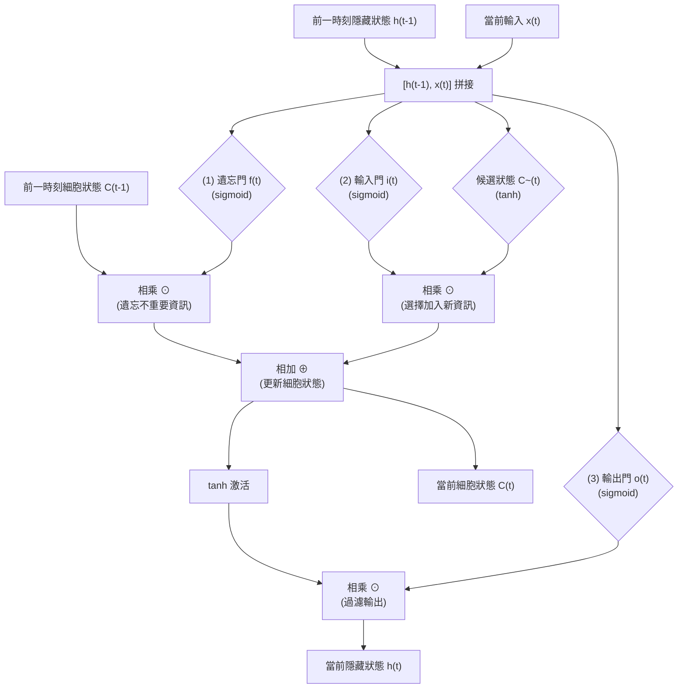

# 16. LSTM 長短期記憶網路介紹

> [!ABSTRACT]
> 本章介紹長短期記憶網路（Long Short-Term Memory, LSTM）的核心原理。傳統 RNN 在面對長序列數據時會因為「梯度消失」而失去長期記憶能力。LSTM 透過引入「細胞狀態（Cell State）」與「閘道（Gates）機制」，有效解決了長期依賴問題。本章將詳細剖析其數學公式、閘道作用，並提供 TensorFlow Keras 的實作說明。

---

## 一、 傳統 RNN 的局限：長期記憶與梯度消失

雖然傳統 RNN 理論上能處理序列數據，但實務上面臨嚴重的**長期依賴（Long-Term Dependency）**問題：當序列過長時，RNN 很容易「忘記」早期時間步輸入的資訊。

### 1. 梯度消失問題 (Gradient Vanishing)
在反向傳播隨時間更新權重時（Backpropagation Through Time, BPTT），求導鏈式法則包含對隱藏狀態梯度的連續相乘：

$$\frac{\partial J^{(4)}}{\partial h^{(1)}} = \frac{\partial J^{(4)}}{\partial h^{(4)}} \cdot \frac{\partial h^{(4)}}{\partial h^{(3)}} \cdot \frac{\partial h^{(3)}}{\partial h^{(2)}} \cdot \frac{\partial h^{(2)}}{\partial h^{(1)}}$$

因為在每個時間步的偏導數中都含有權重矩陣 $W_{hh}$ 的因子：
- 如果 $W_{hh}$ 的特徵值小於 1，連續相乘會導致梯度呈**指數級衰減（趨近於 0）**。
- 這使得靠近輸入端的早期權重無法得到更新，模型因而失去學習長期規律的能力。

---

## 二、 什麼是 LSTM？

**長短期記憶網路 (Long Short-Term Memory, LSTM)** 是一種特殊的 RNN 架構，由 Hochreiter & Schmidhuber 於 1997 年提出。
- **核心目的**：藉由特別設計的結構，克服隨時間反向傳播時的梯度消失問題，保留長期的上下文依賴關係。
- **經典應用**：手寫字體識別、Google 語音識別與機器翻譯、Apple Siri 語音助手等。

---

## 三、 LSTM 單元結構與閘道機制

LSTM 的關鍵在於引入了 **細胞狀態 (Cell State, $C_t$)**。它就像一條傳送帶，直接貫穿整個鏈條，只做少量的線性運算，因此資訊能以極小的衰減在時間軸上傳遞。

LSTM 通過三個由 $\text{sigmoid}$ 函數構成的**閘道（Gates）**來控制傳送帶上資訊的增加或刪除：



### 1. 閘道（Gate）的數學本質
閘道利用 $\text{sigmoid}$ 激活函數輸出一個 $0$ 到 $1$ 之間的值，代表資訊通過的比例（如 $0$ 代表不允許通過，$1$ 代表完全通過），進而實現**選擇性過濾**：
$$\text{Output} = \text{Input} \odot \text{Sigmoid}(\text{Weights})$$

---

## 四、 LSTM 核心運算步驟與公式

### 1. 遺忘門 (Forget Gate, $f_t$)
決定要從上一時刻的細胞狀態 $C_{t-1}$ 中**捨棄（遺忘）多少資訊**。
- **公式**：$f_t = \sigma(W_f \cdot [h_{t-1}, x_t] + b_f)$
- **說明**：輸出接近 $0$ 代表忘記，接近 $1$ 代表完全保留。

### 2. 輸入門 (Input Gate, $i_t$) 與候選狀態 ($\tilde{C}_t$)
決定哪些**新資訊要被記錄**到細胞狀態中。
- **輸入門公式**：$i_t = \sigma(W_i \cdot [h_{t-1}, x_t] + b_i)$ （控制更新的比例）
- **候選狀態公式**：$\tilde{C}_t = \tanh(W_c \cdot [h_{t-1}, x_t] + b_c)$ （生成候選更新內容）

### 3. 更新細胞狀態 (Cell State, $C_t$)
結合遺忘門與輸入門的結果，將舊細胞狀態 $C_{t-1}$ 刷新為新細胞狀態 $C_t$。
- **更新公式**：$C_t = f_t \odot C_{t-1} + i_t \odot \tilde{C}_t$
- **說明**：$\odot$ 代表矩陣的逐元素相乘（Hadamard product）。舊狀態乘上遺忘比例，再加上新狀態乘上輸入比例。

### 4. 輸出門 (Output Gate, $o_t$) 與隱藏狀態 ($h_t$)
決定當前的**隱藏狀態（即輸出）$h_t$ 應該輸出哪些內容**。
- **輸出門公式**：$o_t = \sigma(W_o \cdot [h_{t-1}, x_t] + b_o)$
- **隱藏狀態公式**：$h_t = o_t \odot \tanh(C_t)$
- **說明**：將細胞狀態經過 $\tanh$ 壓縮至 $[-1, 1]$，再乘上輸出門的值，即可過濾出最終要輸出的特徵向量。

---

## 五、 TensorFlow Keras 中的 LSTM 使用

與 SimpleRNN 類似，Keras 提供了 `LSTMCell` 與 `LSTM` 兩種使用方式：

### 1. `LSTMCell` vs `LSTM` 層
- **`LSTMCell`**：只負責單個時間步的計算。它的內部狀態變數包含兩個：`[h_t, c_t]`（隱藏狀態與細胞狀態）。
- **`LSTM` 層**：高階封裝。會自動將多個 `LSTMCell` 串聯，完成整條序列的運算。

### 2. 程式碼實作範例

```python
"""
File: lstm_model_demo.py
Description: 使用 TensorFlow Keras 建立多層 LSTM 的實作程式碼範例
"""
import tensorflow as tf
from tensorflow.keras import layers, models

# 1. 建立一個堆疊兩層 LSTM 的二分類模型
model = models.Sequential([
    # 輸入層：假設輸入序列長度為 80，特徵維度為 32
    layers.Input(shape=(80, 32)),
    
    # 第一層 LSTM：因為後面還有一層 LSTM，因此 return_sequences 必須設定為 True
    layers.LSTM(units=64, return_sequences=True, dropout=0.2),
    
    # 第二層 LSTM：僅需要最後時間步的輸出，因此 return_sequences 設為 False (預設值)
    layers.LSTM(units=32, return_sequences=False, dropout=0.2),
    
    # 全連接輸出層
    layers.Dense(units=1, activation='sigmoid')
])

model.compile(optimizer='adam', loss='binary_crossentropy', metrics=['accuracy'])
model.summary()
```
---

## 六、 相關連結
- [[15.RNN網路介紹]]：回顧 RNN 的基礎架構與梯度消失的成因。
- [[17.GRU介紹]]：學習 LSTM 的精簡版本，僅用兩個閘道即可達到相近效果。
