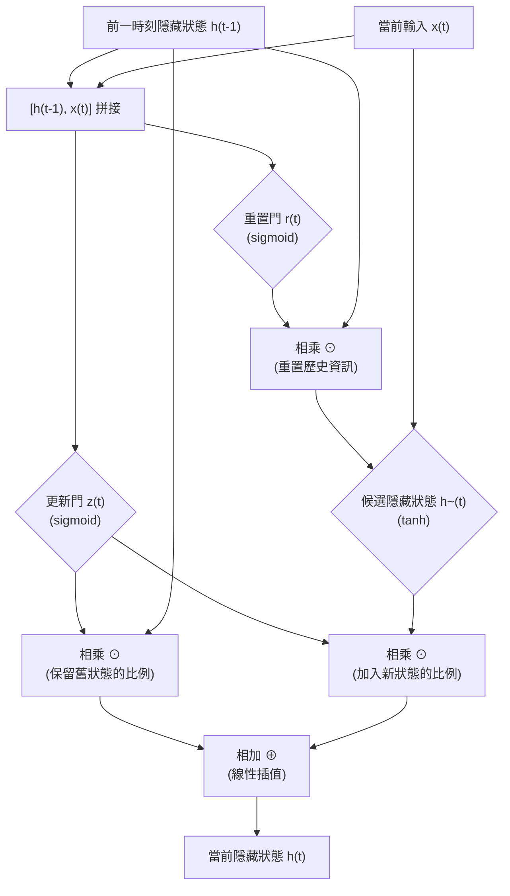

# 17. GRU 閘門循環單元介紹

> [!ABSTRACT]
> 本章介紹閘門循環單元（Gated Recurrent Unit, GRU）的核心原理。GRU 由 K. Cho 等人於 2014 年提出，與 LSTM 一樣是為了解決傳統 RNN 在長序列訓練中的梯度消失問題；但 GRU 僅用「重置門」與「更新門」兩個閘道，內部結構比 LSTM 更精簡、運算速度更快。本章將解析其閘道運作機制、數學公式，並提供 TensorFlow Keras 的實作說明。

---

## 一、 GRU 的提出背景

GRU（Gate Recurrent Unit）與 LSTM 設計理念相似，同樣是為了解決長期記憶與反向傳播中的梯度消失問題而設計的循環神經網路。

- **提出者**：GRU 由 K. Cho 等人於 2014 年引入。
- **與 LSTM 的關係**：GRU 保留了 LSTM 緩解梯度消失的特性，但內部構造比 LSTM 更簡單、運算速度更快。
- **輸入輸出結構**：GRU 的輸入輸出結構與普通的 RNN 相同，僅在內部多了閘道機制來控制資訊的流動。

> [!TIP]
> LSTM 有三個閘道（遺忘門、輸入門、輸出門）與兩個狀態（$h_t$、$C_t$）；GRU 則簡化為**兩個閘道**（重置門、更新門），且只保留**一個狀態** $h_t$，因此參數量更少、訓練更快。

---

## 二、 GRU 單元結構與閘道機制

GRU 有兩個門，即一個**重置門（Reset Gate, $r_t$）**和一個**更新門（Update Gate, $z_t$）**。結合前一時刻的隱藏狀態 $h_{t-1}$ 與當前輸入 $x_t$，GRU 會得到當前隱藏節點的輸出，同時也是要傳遞給下一個節點的隱狀態 $h_t$。



### 1. 重置門（Reset Gate）
- **功能**：控制上一時間步的資訊要被重置（遺忘）多少。
- **意義**：重置門是用來決定上一時刻隱藏狀態 $h_{t-1}$ 中的資訊有多少需要被捨棄。由於 $h_{t-1}$ 可能包含了時間序列截至上一時間步的全部歷史資訊，重置門可用來丟棄與當前預測無關的歷史資訊。
- **判斷原則**：重置門的值越小，代表忽略的歷史資訊越多。

### 2. 更新門（Update Gate）
- **功能**：控制新資訊與舊資訊的融合程度（記憶更新）。
- **意義**：更新門幫助模型決定要將多少過去的資訊傳遞到未來，也就是前一時間步的狀態與當前時間步的候選狀態各自要保留多少比例。
- **判斷原則**：更新門的值越大，代表帶入越多上一時刻的狀態資訊。

---

## 三、 GRU 核心運算步驟與公式

### 1. 重置門 (Reset Gate, $r_t$)
$$r_t = \sigma\big(W_r \cdot [h_{t-1}, x_t] + b_r\big)$$

### 2. 更新門 (Update Gate, $z_t$)
$$z_t = \sigma\big(W_z \cdot [h_{t-1}, x_t] + b_z\big)$$

### 3. 候選隱藏狀態 (Candidate Hidden State, $\tilde{h}_t$)
在重置門的作用下，計算出新的候選隱藏狀態，代表當前時間步的候選記憶內容：
$$\tilde{h}_t = \tanh\big(W_h \cdot [r_t \odot h_{t-1}, x_t] + b_h\big)$$
- **說明**：$\odot$ 為逐元素相乘（Hadamard product）。$r_t \odot h_{t-1}$ 代表對前一隱藏狀態做選擇性的遺忘後，再與當前輸入 $x_t$ 一起計算候選狀態。

### 4. 最終隱藏狀態 (Final Hidden State, $h_t$)
透過更新門 $z_t$ 的加權組合，將候選隱藏狀態 $\tilde{h}_t$ 與前一隱藏狀態 $h_{t-1}$ 進行**線性插值**融合：
$$h_t = (1 - z_t) \odot h_{t-1} + z_t \odot \tilde{h}_t$$
- **$(1-z_t) \odot h_{t-1}$**：對隱藏的原狀態，選擇性地遺忘。
- **$z_t \odot \tilde{h}_t$**：對當前節點的候選資訊，進行選擇性的記憶。

---

## 四、 GRU 與 LSTM 的比較

| 比較項目 | LSTM | GRU |
| :--- | :--- | :--- |
| **閘道數量** | 3 個（遺忘門、輸入門、輸出門） | 2 個（重置門、更新門） |
| **狀態數量** | 2 個（細胞狀態 $C_t$、隱藏狀態 $h_t$） | 1 個（隱藏狀態 $h_t$） |
| **參數量** | 較多 | 較少 |
| **運算速度** | 較慢 | 較快 |
| **適用場景** | 資料量大、需要更精細長期記憶控制的任務 | 資料量較小或需要較快訓練速度的任務 |

---

## 五、 TensorFlow Keras 中的 GRU 使用

與 LSTM、SimpleRNN 類似，Keras 提供了 `GRUCell` 與 `GRU` 兩種使用方式：`GRUCell` 只負責單一時間步的運算，`GRU` 層則是高階封裝，會自動將多個 `GRUCell` 串聯以完成整條序列的運算。

```python
"""
File: gru_model_demo.py
Description: 使用 TensorFlow Keras 建立多層 GRU 的實作程式碼範例
"""
import tensorflow as tf
from tensorflow.keras import layers, models

# 1. 建立一個堆疊兩層 GRU 的二分類模型
model = models.Sequential([
    # 輸入層：假設輸入序列長度為 80，特徵維度為 32
    layers.Input(shape=(80, 32)),

    # 第一層 GRU：因為後面還有一層 GRU，因此 return_sequences 必須設定為 True
    layers.GRU(units=64, return_sequences=True, dropout=0.2),

    # 第二層 GRU：僅需要最後時間步的輸出，因此 return_sequences 設為 False (預設值)
    layers.GRU(units=32, return_sequences=False, dropout=0.2),

    # 全連接輸出層
    layers.Dense(units=1, activation='sigmoid')
])

model.compile(optimizer='adam', loss='binary_crossentropy', metrics=['accuracy'])
model.summary()
```

---

## 六、 相關連結
- [[16.LSTM 介紹]]：回顧 LSTM 的三閘道機制，比較與 GRU 的異同。
- [[15.RNN網路介紹]]：回顧 RNN 的基礎結構與梯度消失問題的成因。
