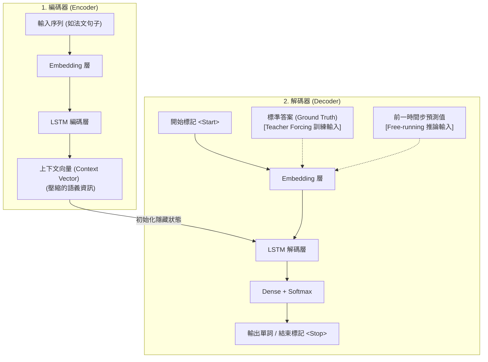

# 18. Sequence-to-Sequence (Seq2Seq) 模型

> [!ABSTRACT]
> 本篇筆記介紹 Sequence-to-Sequence (Seq2Seq) 模型的架構與原理。探討傳統 RNN 面臨輸入與輸出必須等長的限制，並說明如何利用「編碼器-解碼器 (Encoder-Decoder)」架構解決變長序列的生成問題，最後深入解析訓練時使用的「教師強迫 (Teacher Forcing)」技術及其優缺點。

---

## 一、 傳統 RNN 的限制與 Seq2Seq 的誕生

傳統的循環神經網路（RNN/LSTM）在處理序列時，其隱藏狀態 $h_t$ 對應一個即時輸出 $y_t$，這使得**輸入序列與輸出序列的長度必須是相等的（Many-to-Many 同步模式）**。

然而，在許多實際的 NLP 任務中，輸入與輸出的長度通常是不一致的：
- **機器翻譯**：英文 `"An apple a day keeps the doctor away"` (8個單詞) 翻譯成中文為 `"一天一蘋果，醫生遠離我"` (10個中文字)。
- **文本摘要**：輸入整篇文章（數千字），輸出摘要（數十字）。
- **語音識別**：輸入幾秒的音訊訊號（長度極長），輸出短短一句台詞（長度短）。

為了克服輸入與輸出維度固定的限制，Google 團隊於 2014 年開發了 **Seq2Seq（序列到序列）** 模型架構，實現了**多對多（Many-to-Many 延遲模式）**的非等長序列轉換，這在自然語言處理領域取得了重大的突破。

---

## 二、 Encoder-Decoder (編碼器-解碼器) 架構

Seq2Seq 核心由兩個循環神經網路（RNN/LSTM/GRU）組成：**編碼器 (Encoder)** 與 **解碼器 (Decoder)**。

```
[輸入序列] ➔ [ 編碼器 Encoder ] ➔ [ 上下文向量 (Context Vector) ] ➔ [ 解碼器 Decoder ] ➔ [輸出序列]
```

### 1. 編碼器 (Encoder)
- **作用**：負責讀入源序列（例如法文句子），並通過循環層（LSTM）逐步處理。
- **產出**：編碼器不輸出具體的預測詞，而是將整句話的語義壓縮成一個固定維度的向量，稱為**上下文向量 (Context Vector)** 或 **思考向量 (Thought Vector)**。這個向量代表了整句話的全局語義資訊。

### 2. 解碼器 (Decoder)
- **作用**：以編碼器輸出的**上下文向量**作為其 LSTM 的初始狀態。
- **預測機制**：在起點輸入一個開始標記 `<Start>`，解碼器開始自迴歸式地（Autoregressive）一步步預測下一個單詞，直到輸出結束標記 `<Stop>` 為止。

### 3. Seq2Seq 系統架構圖 (Mermaid)



---

## 三、 訓練模式：Teacher Forcing (教師強迫)

在訓練 RNN/Seq2Seq 模型時，解碼器在 $t$ 時刻的輸入有兩種模式：

### 1. 自自由運行模式 (Free-running Mode)
- **作法**：將上一時刻 $t-1$ 的**模型預測輸出** $\hat{y}_{t-1}$ 作為當前時刻 $t$ 的輸入。
- **缺點**：
  1. **收斂極慢**：訓練初期，模型預測能力非常弱，經常輸出垃圾字元。一旦 $t-1$ 步預測錯誤，後面所有步驟都會跟著學錯，導致模型極難收斂。
  2. **模型不穩定**：容易在訓練過程中發生梯度波動。

### 2. 教師強迫模式 (Teacher Forcing)
- **作法**：在**訓練階段**，每次都不使用上一個時間步模型的預測輸出，而是直接將**標準答案 (Ground Truth, $y_{t-1}$)** 強制注入作為下一時刻 $t$ 的輸入。

```
[Free-running]  預測值 ŷ(t-1)  ➔ 注入 ➔  解碼器輸入 x(t)
[Teacher Force] 正解值 y(t-1)  ➔ 注入 ➔  解碼器輸入 x(t)
```

- **優勢**：
  - **加速收斂**：即便前面某個步驟預測錯了，下一步依然能從正確的軌道上繼續學習。
  - **訓練更穩定**：保證了各個時間步輸入資料的品質。

---

## 四、 Teacher Forcing 的缺點：暴露偏差 (Exposure Bias)

雖然 Teacher Forcing 提升了訓練速度，但它存在一個致命缺點：

> [!WARNING]
> **暴露偏差 (Exposure Bias)**
> - **問題**：模型在訓練時習慣了「標準答案」的引導（像是有老師牽著手走路），但到了**測試/推論階段**，並沒有標準答案可用，模型必須切換回「Free-running」模式（用自己上一輪的預測當輸入）。
> - **後果**：如果模型在測試時第一步預測錯了，這個錯誤會被當作下一步的輸入，導致誤差迅速累積擴大（Cascading Errors）。因此，Teacher Forcing 的跨領域（Cross-domain）泛化能力通常較差，在測試集上的效果可能會低於訓練集。
> - **解決辦法**：實務上常採用**計劃性採樣 (Scheduled Sampling)**，在訓練初期使用 100% Teacher Forcing，隨著訓練代數增加，逐漸提高 Free-running 的比例，讓模型慢慢學會自我糾錯。