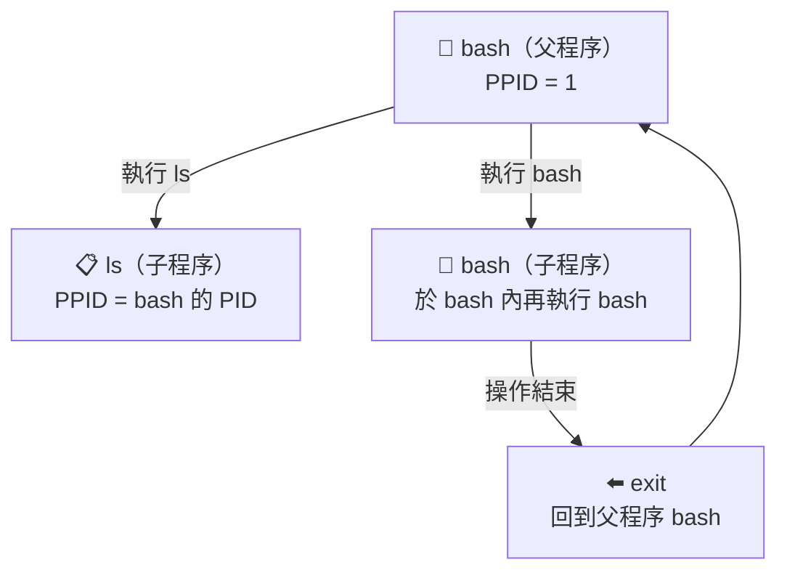
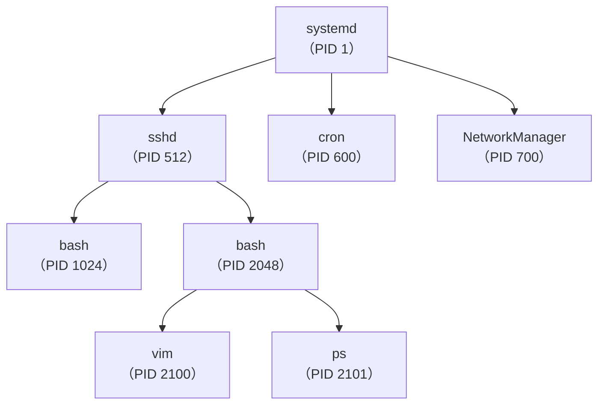
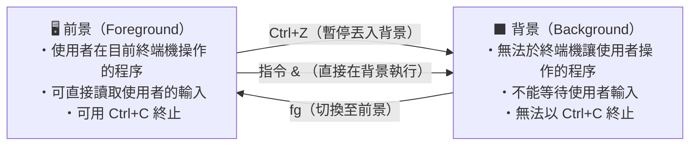

# 程序（Process）

程式被觸發載入至記憶體中執行，即稱為程序；同時也會載入執行者的權限屬性、程式碼與所需資料等。系統會指派對應的 **Process ID（PID）** 用來管理程序。


---

# 父程序與子程序

「父程序」衍生出「子程序」：



- 例如在 bash 內執行 `ls`，則父程序為 bash，子程序為 ls
- 例如在 bash 內執行 `bash` 指令，可新生一隻 bash
- 子程序的 bash 操作結束後，可執行 `exit` 回到父程序 bash

---

# 檢視程序（ps）

```bash
ps          # 僅列出自己的 bash 相關程序
ps -l       # 列出詳細資訊
ps aux      # 列出所有系統運作的程序（選項前沒有 -）
ps aux | grep "關鍵字"   # 搭配 grep 使用
```

**輸出範例：**

```
PID   TTY      TIME     CMD
4276  pts/1    00:00:00 bash
4446  pts/1    00:00:00 ps
```

**欄位說明：**

| 欄位 | 說明 |
|------|------|
| `PID` | Process ID |
| `PPID` | Parent PID（父程序 ID） |
| `TTY` | 登入的終端機代號 |
| `TIME` | 此程序所消耗的 CPU 時間 |
| `CMD` | 正在執行的程序名稱 |
| `NI` | NICE 值（優先度） |

---

# 以樹狀結構檢視程序（pstree）

```bash
pstree        # 以樹狀結構顯示所有程序
pstree -p     # 同時顯示 PID
pstree user1  # 只顯示 user1 的程序樹
```



---

# 動態觀察程序的變化（top）

```bash
top           # 持續性觀察程序變化（預設每 3 秒更新一次）
top -d 10     # 設定每 10 秒更新一次
```

**top 畫面佈局：**

```
top - 14:30:00 up 2 days,  3:20,  2 users,  load average: 0.10, 0.08, 0.05
Tasks: 120 total,   1 running, 119 sleeping,   0 stopped,   0 zombie
%Cpu(s):  2.0 us,  1.0 sy,  0.0 ni, 96.5 id,  0.5 wa
MiB Mem :   7850.0 total,   3200.0 free,   2100.0 used,   2550.0 buff/cache
MiB Swap:   2048.0 total,   2048.0 free,      0.0 used.   5400.0 avail Mem
┌──────────────────────────────────────────────────────────────────────┐
│  PID  USER   PR  NI    VIRT    RES    SHR  S  %CPU  %MEM   TIME+   COMMAND │
│  1024 user1  20   0  300000  10000   6000  S   1.5   0.1  0:03.00  bash    │
│   700 root   20   0  500000  20000  10000  S   0.5   0.2  5:12.00  NetworkMgr│
└──────────────────────────────────────────────────────────────────────┘
```

**執行 top 後的互動式操作：**

| 按鍵 | 功能 |
|------|------|
| `h` | 顯示說明文字 |
| `P` | 依據 CPU 使用時間排序（預設） |
| `M` | 依據記憶體使用量排序 |
| `T` | 依據執行時間排序 |
| `N` | 以 PID 由大至小排序 |
| `u 帳號` | 只列出該帳號的 process |
| `k [pid]` | 刪除 process |
| `d 秒數` | 設定更新的秒數 |
| `q` | 結束離開 |

---

# 終止程序（kill / killall / pkill / xkill）

## kill

```bash
kill [-信號] PID      # 傳送終止信號給 PID 程序
kill -l               # 列出所有能使用的信號（Signal）

# 範例
ps aux | grep "firefox"   # 先查出 PID
pgrep firefox             # 或使用 pgrep 查詢
kill 12345                # 正常終止
kill -9 12345             # 強制終止（SIGKILL）
```

## killall

```bash
killall 程序名稱   # 依名稱終止所有符合的程序

# 範例
vim &     # 背景執行第一個 vim
vim &     # 背景執行第二個 vim
ps        # 查看程序
killall vim   # 一次終止所有 vim
```

## pkill

類似 `killall`，但使用**正規表達式（regex）**比對程序名稱，可模糊搜尋後殺掉程序（因此更加危險）。

```bash
pkill -e firef.+    # 砍掉 firefox 相關的程序（-e 顯示砍了哪個程序）
pkill -e firef      # 簡寫，效果相同
```

## xkill

當視窗程序當掉，不容易找到 PID 或名稱時，可用 `xkill` 直接點選視窗關閉。

```bash
xkill
# Select the window whose client you wish to kill with button 1....
# 用滑鼠在 X window 的視窗上按一下，就會砍掉該視窗
```

---

# 前景（Foreground）與背景（Background）



| 操作 | 說明 |
|------|------|
| `指令 &` | 直接在背景執行 |
| `Ctrl+Z` | 將前景程序暫停並丟到背景 |
| `fg %N` | 將背景的 job N 切換至前景執行 |
| `bg %N` | 讓背景暫停的 job N 繼續在背景執行 |
| `jobs` | 查詢背景程序狀態 |
| `jobs -l` | 列出 job number、指令與 PID |
| `jobs -r` | 列出正在背景執行（run）的程序 |
| `jobs -s` | 列出正在背景暫停（stop）的程序 |

## 操作範例

```bash
vim &             # 於背景執行 vim（job 1）
# 在 vim 裡按 Ctrl+Z  → 把 vim 暫停並丟到背景
top               # 於前景開啟 top
# 按 Ctrl+Z         → 把 top 暫停並丟到背景（job 2）
sleep 10000 &     # 於背景執行 sleep（job 3）

jobs -l           # 查詢背景程序狀態
fg %1             # 將 job 1（vim）切換至前景
# 按 Ctrl+Z         → 再將 vim 丟回背景暫停
bg %3             # 讓 job 3（sleep）在背景繼續執行

jobs
# [1]-  Stopped     vim
# [2]+  Stopped     top
# [3]   Running     sleep 10000 &
```