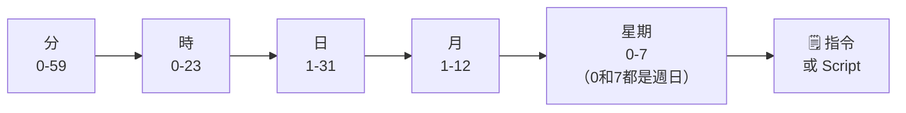

# 循環性的工作排程（crontab）

`crontab` 可讓系統於指定時間（或週期）自動執行某些任務，例如：
- 定期更新系統套件
- 備份或清理檔案（`tar` + `gzip` 等）

> 若工作任務較複雜，建議將多個指令寫成 Script，設定時會較簡潔

---

## crontab 語法格式

```
分  時  日  月  星期  指令（或 Script）
```



### 特殊字符

| 字符 | 說明 | 範例 |
|------|------|------|
| `*` | 代表任何時刻 | `* * * * *` 每分鐘 |
| `,` | 列舉時段 | `1,3,5` 代表第 1、3、5 |
| `-` | 一段時間範圍 | `9-11` 代表 9、10、11 |
| `/數字` | 每隔單位間隔 | `*/3` 每隔 3 個單位 |

### 快速關鍵字

| 關鍵字 | 等同 | 說明 |
|--------|------|------|
| `@yearly` | `0 0 1 1 *` | 每年元旦 |
| `@daily` | `0 0 * * *` | 每天午夜 |
| `@hourly` | `0 * * * *` | 每小時整點 |
| `@reboot` | — | 系統啟動時執行 |

---

## crontab 範例

| 排程設定 | 說明 |
|---------|------|
| `0 22 * * 5 指令` | 每週五 22:00 執行 |
| `0 9,11 * * * 指令` | 每日 09:00 及 11:00 執行 |
| `*/5 * * * * 指令` | 每 5 分鐘執行 |
| `* * * * * 指令` | 每分鐘執行 |
| `0 9-18 * * 1-5 指令` | 每週一至週五 09:00 至 18:00 執行 |
| `@yearly 指令` | 每年元旦執行 |
| `@reboot 指令` | 開機後執行 |

---

## 語法詳細解析

每一條 crontab 規則由 5 個時間欄位組成，**由左到右**依序為：

```
┌──────── 分鐘  (0-59)
│ ┌────── 小時  (0-23)
│ │ ┌──── 日期  (1-31)
│ │ │ ┌── 月份  (1-12)
│ │ │ │ ┌ 星期  (0-7，0 和 7 都代表週日)
│ │ │ │ │
* * * * *  指令
```

### 場景一：固定時間點

**每天早上 9 點整執行備份腳本：**

```
0 9 * * * bash /home/user1/backup.sh
│ │ │ │ │
│ │ │ │ └── 星期：* = 每天都算
│ │ │ └──── 月份：* = 每個月
│ │ └────── 日期：* = 每一天
│ └──────── 小時：9 = 早上 9 點
└────────── 分鐘：0 = 0 分（整點）
```

---

### 場景二：每隔一段時間

**每 15 分鐘監控一次系統狀態：**

```
*/15 * * * * bash /home/user1/monitor.sh
  │  │ │ │ │
  │  │ │ │ └── 星期：* = 每天
  │  │ │ └──── 月份：* = 每月
  │  │ └────── 日期：* = 每日
  │  └──────── 小時：* = 每小時
  └─────────── 分鐘：*/15 = 每隔 15 分鐘（0、15、30、45）
```

---

### 場景三：列舉特定時段

**每天 8:00、12:00、18:00 寄出報告：**

```
0 8,12,18 * * * bash /home/user1/report.sh
│    │     │ │ │
│    │     │ │ └── 星期：* = 每天
│    │     │ └──── 月份：* = 每月
│    │     └────── 日期：* = 每日
│    └──────────── 小時：8,12,18 = 列舉三個時間點
└────────────────── 分鐘：0 = 整點
```

---

### 場景四：範圍 + 間隔組合

**週一至週五，每天上班時間（9~18 點）的每整點執行：**

```
0 9-18 * * 1-5 bash /home/user1/workhour.sh
│  │   │ │  │
│  │   │ │  └── 星期：1-5 = 週一到週五（1=週一，5=週五）
│  │   │ └───── 月份：* = 每月
│  │   └─────── 日期：* = 每日（由星期欄控制）
│  └─────────── 小時：9-18 = 9 點到 18 點
└──────────────── 分鐘：0 = 整點
```

---

### 場景五：複合條件

**每月 1 日和 15 日，凌晨 2:30 執行資料庫備份：**

```
30 2 1,15 * * bash /home/user1/db_backup.sh
│  │  │   │ │
│  │  │   │ └── 星期：* = 不限星期
│  │  │   └──── 月份：* = 每個月
│  │  └──────── 日期：1,15 = 每月 1 號和 15 號
│  └─────────── 小時：2 = 凌晨 2 點
└──────────────── 分鐘：30 = 30 分
```

---

### ⚠️ 常見錯誤

| 錯誤寫法 | 問題 | 正確寫法 |
|---------|------|---------|
| `0 9 * * 1-5` 以為是「週一到週五的9點」| 日期（`*`）與星期（`1-5`）同時設定時，**任一符合就執行**（OR 邏輯），而非 AND | 確認 `*` 的意義，若需精確控制可用腳本判斷 |
| `60 * * * *` | 分鐘欄位只能 0-59，60 無效 | `0 * * * *`（每小時整點）|
| `0 25 * * *` | 小時欄位只能 0-23，25 無效 | `0 1 * * *`（凌晨 1 點）|

> - 描述腳本位置時，建議使用**絕對路徑**
>   - 例如：`0 9 * * * bash /home/user1/job1.sh`
> - **無法**使用「幾月幾號且為星期幾」（日與星期互斥）

---

## crontab 常用指令

| 指令 | 說明 |
|------|------|
| `crontab -e` | 編輯工作排程（預設用 nano，設定檔於 `/var/spool/cron/crontabs/使用者帳號`） |
| `crontab -l` | 檢視工作排程清單 |
| `crontab -r` | 刪除**所有**的工作排程 |

> 若只要移除其中一項排程，請執行 `crontab -e` 進行編輯

---

# 限定能使用 crontab 的帳號

預設系統上任何帳號皆可使用 `crontab`，若要進一步限定，可編輯以下設定檔：

| 設定檔 | 類型 | 說明 |
|--------|------|------|
| `/etc/cron.allow` | **白名單** | 將可以使用 crontab 的帳號寫入；不在此檔案內的使用者**不可**使用 |
| `/etc/cron.deny` | **黑名單** | 將不可以使用 crontab 的帳號寫入；未記錄在此的使用者**可以**使用 |

---

# 系統層級的工作排程

> 需 root 權限，編輯 `/etc/crontab`

```bash
vi /etc/crontab
```

系統層級的語法比個人多了一個**執行者身分**欄位：

```
分  時  日  月  星期  執行者身分  指令
```

**設定檔內容說明：**

```
SHELL=/bin/bash                          # 使用哪種 shell 介面
PATH=/sbin:/bin:/usr/sbin:/usr/bin       # 設定執行檔搜尋路徑
MAILTO=root                              # 若有額外 STDOUT，以 email 寄給誰

# .---------------- minute   (0 - 59)
# | .------------- hour     (0 - 23)
# | | .---------- day       (1 - 31)
# | | | .------- month      (1 - 12)
# | | | | .---- day of week (0 - 6，週日=0 或 7)
# | | | | |
# * * * * *  user-name  command

0 9 * * *  root  updatedb   # 以 root 身分執行更新索引
```

---

## 系統自動執行目錄（anacron）

也可將腳本置於下列目錄內，讓系統自動執行：
- 可減少因系統關機而過期、導致工作沒有執行的狀況
- 適合**不要求精準執行時刻**，但**一定要執行**的任務
- 若要檢視系統的週期設定，需 root 權限：`cat /etc/anacrontab`

| 目錄 | 執行頻率 | 補跑機制 |
|------|---------|---------|
| `/etc/cron.daily/` | 每天執行一次 | 未執行過則開機 **5 分鐘**後執行 |
| `/etc/cron.weekly/` | 每 7 天執行一次 | 未執行過則開機 **25 分鐘**後執行 |
| `/etc/cron.monthly/` | 每月執行一次 | 未執行過則開機 **45 分鐘**後執行 |

---

# 系統服務（systemctl）

```bash
systemctl [動作] [服務名稱]   # 需 root 權限（status 例外）
```

以 `cron.service` 為例：

| 指令 | 說明 |
|------|------|
| `systemctl stop cron.service` | 停止該系統服務 |
| `systemctl start cron.service` | 啟動該系統服務 |
| `systemctl restart cron.service` | 重啟該系統服務 |
| `systemctl reload cron.service` | 重新載入設定檔，**不需停止服務** |
| `systemctl enable cron.service` | 於**下次開機時啟動**服務 |
| `systemctl disable cron.service` | 於**下次開機時停止**服務 |
| `systemctl status cron.service` | 檢視服務運行狀態（**不需 root**） |