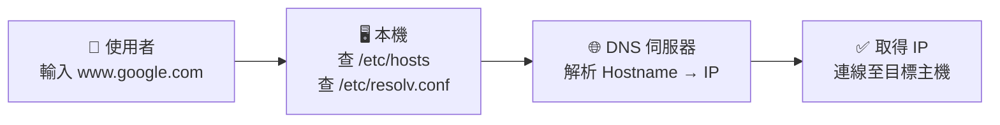
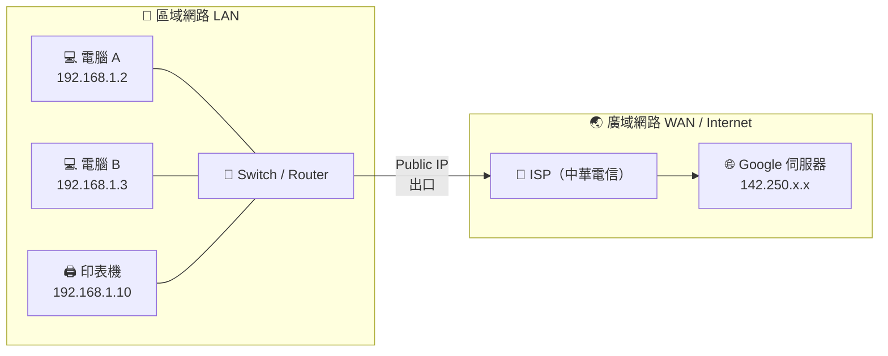

# 檢視或設定 Linux 主機名稱（hostname）

```bash
hostname                          # 顯示主機名稱
hostnamectl hostname [NAME]       # 設定新主機名稱
cat /etc/hostname                 # 檢視主機名稱設定檔
```

## 相關設定檔

| 設定檔 | 說明 |
|--------|------|
| `/etc/hostname` | 記錄系統主機名稱 |
| `/etc/hosts` | 遠端主機名稱與 IP 的對應（例如 `127.0.0.1 localhost`） |
| `/etc/host.allow` | 白名單：設定哪些 IP、主機、使用者帳號**可以**訪問 |
| `/etc/host.deny` | 黑名單：設定哪些 IP、主機、使用者帳號**不可**訪問 |

---

# Domain Name System（DNS）

DNS 負責將人類可讀的主機名稱（Hostname）轉換為 IP 位址，或反向查詢。



## 常用 DNS 供應商

| 供應商 | DNS 伺服器 IP |
|--------|--------------|
| HiNet（中華電信） | `168.95.1.1`、`168.95.192.1` |
| Google Public DNS | `8.8.8.8`、`8.8.4.4` |
| Cloudflare | `1.1.1.1`、`1.0.0.1` |

![[{67FF5B25-8F1A-4FDC-98BE-556B190CFF2B}.png|491]]

## DNS 設定檔案（/etc/resolv.conf）

此檔案用來設定 DNS 用戶端要求名稱解析時的各項內容：

```
nameserver 8.8.8.8      # 指定第一台 DNS 伺服器 IP
nameserver 8.8.4.4      # 可指定多部，用戶端會依序查詢
```

---


# 查詢主機名稱與 IP 位址的對應

```bash
host www.ncu.edu.tw           # 用主機名稱查詢 IP
host 140.115.17.151           # 用 IP 查詢主機名稱
nslookup www.ncu.edu.tw       # 用主機名稱查詢 IP
nslookup 140.115.17.36        # 用 IP 查詢主機名稱
```
==用 IP 查詢主機名稱有可能查不到==

**查詢結果範例：**

```
www.ncu.edu.tw has address 140.115.17.151
www.ncu.edu.tw has address 140.115.17.152
www.ncu.edu.tw has address 140.115.17.36
151.17.115.140.in-addr.arpa domain name pointer www-vm1.cc.ncu.edu.tw.
```

---

# 網路卡名稱

| 類型 | 名稱 | 說明 |
|------|------|------|
| **Ethernet（有線）** | `eth0`、`eth1` / `enp0s3` | 實體網路介面；現在多使用 `enp0s3` 命名方式 |
| **Loopback（本地迴路）** | `lo` | 虛擬網路介面；不須實體網路卡，可在主機本地運行網路服務，連線至 `127.0.0.1`（`http://localhost`）存取本地網站 |

---

# 檢視網路介面的狀態（ip addr）

```bash
ip addr          # 檢視所有網路介面的 IP 位址與狀態
ip addr show     # 同上
```

![[{6871A44C-389F-419D-8DFC-0AC48526A4A3}.png]]

---

# 編輯網路卡設定檔以設定 IP

```bash
sudo vim /etc/netplan/01-xxx.yaml   # 編輯設定檔（需 root 權限）
sudo netplan try                     # 測試並啟用設定
sudo netplan apply                   # 不測試，直接啟用設定
```

---

# 網路架構與連結埠

## 網路範圍



### 三種網路類型比較

| 項目 | LAN（區域網路） | WAN（廣域網路） | Internet（網際網路） |
|------|---------------|---------------|-------------------|
| **全名** | Local Area Network | Wide Area Network | — |
| **範圍** | 同一棟建築、辦公室、家庭 | 跨城市、跨國家 | 跨越全球 |
| **典型例子** | 公司內部網路、家用 Wi-Fi | 全台各地戶政機關網路、企業 WAN | WWW、Gmail、YouTube |
| **IP 類型** | Private IP | Public IP 或 Private IP | Public IP |
| **速度** | 快（100 Mbps ~ 10 Gbps） | 較慢（依線路而定） | 依 ISP 而定 |
| **管理者** | 自行管理 | 電信業者 / 企業 IT | 無單一管理者 |
| **安全性** | 相對封閉，較安全 | 需加密（VPN / HTTPS） | 需加密（HTTPS / TLS） |

### Private IP vs Public IP

| 類型 | 說明 | 常見範圍 |
|------|------|---------|
| **Private IP** | 僅在內部網路使用，不可直接連上 Internet | `192.168.0.0/16`、`10.0.0.0/8`、`172.16.0.0/12` |
| **Public IP** | 由 ISP 分配，可直接被 Internet 識別 | 其餘 IP（例如 `8.8.8.8`、`142.250.x.x`） |

> LAN 內的設備使用 Private IP，透過 **NAT**（見下方）轉換後才能對外連到 Internet

---

### IP 位址結構

IPv4 位址由 **32 個位元（bit）** 組成，分為 4 組（每組 8 bit），以十進位表示：

```
192      . 168      . 1        . 100
11000000   10101000   00000001   01100100
```

每組的範圍是 `0`（`00000000`）到 `255`（`11111111`）。

---

### 子網路遮罩（Subnet Mask）

#### 遮罩是用來做什麼的？

當一台主機要送封包給某個 IP 時，它**不知道對方在不在同一個 LAN 內**。  
遮罩的用途就是讓主機自己算出：

> **「目標 IP 跟我是同一個網段嗎？」**
> - ✅ **同網段** → 直接在 LAN 內傳送（不需要經過閘道）
> - ❌ **不同網段** → 把封包交給**閘道（Gateway）**，讓它轉發出去

**判斷方式：把自己的 IP 和目標 IP 各別與遮罩做 AND 運算，結果相同就是同網段。**

```
自己的 IP：  192.168.1.100   AND   遮罩 255.255.255.0   →   192.168.1.0  ← 所在網段
目標 IP  ：  192.168.1.200   AND   遮罩 255.255.255.0   →   192.168.1.0  ← 同網段！→ 直送
目標 IP  ：  192.168.2.50    AND   遮罩 255.255.255.0   →   192.168.2.0  ← 不同網段！→ 送給閘道
```

| 情境 | 目標 IP | 結果 | 處理方式 |
|------|---------|------|---------|
| 印表機在同一個辦公室 | `192.168.1.20` | 同網段 | 直接在 LAN 內傳 |
| 瀏覽 Google | `142.250.x.x` | 不同網段 | 交給閘道（路由器）→ ISP → Internet |

---

#### 遮罩結構

遮罩用來將 IP 位址切分為兩個部分：

```
IP 位址：  192.168.1.100
遮  罩：   255.255.255.0
           ──────────── ─
           網路部分     主機部分
```

| 部分 | 說明 |
|------|------|
| **網路部分**（Network） | 遮罩中 `1` 的位元對應的 IP 位元，用來識別「哪個網路」 |
| **主機部分**（Host） | 遮罩中 `0` 的位元對應的 IP 位元，用來識別「網路內的哪台主機」 |

**二進位拆解範例（`255.255.255.0`）：**

```
IP    ：  11000000 . 10101000 . 00000001 . 01100100
遮罩  ：  11111111 . 11111111 . 11111111 . 00000000
          ──────────────────────────────   ────────
          網路部分（固定，不可改變）          主機部分（可分配給主機）
```

所以 `192.168.1.0/24` 這個網段內，可分配的主機位址為 `192.168.1.1` ～ `192.168.1.254`（共 254 台）。

---


### CIDR 表示法

現代常用 **CIDR（Classless Inter-Domain Routing）** 來簡化遮罩的寫法：

```
192.168.1.0 / 24
            ──┘
            遮罩中有幾個連續的 1（即網路部分有幾 bit）
```

| CIDR | 等同遮罩 | 可用主機數 | 說明 |
|------|---------|----------|------|
| `/8` | `255.0.0.0` | 16,777,214 | `10.x.x.x` 大型私有網路 |
| `/16` | `255.255.0.0` | 65,534 | `192.168.x.x` 中型網路 |
| `/24` | `255.255.255.0` | 254 | 最常見的家用/辦公室區網 |
| `/30` | `255.255.255.252` | 2 | 點對點連線（P2P） |
| `/32` | `255.255.255.255` | 1 | 指定單一主機 |

> **可用主機數 = 2^(主機位元數) - 2**（扣掉網路位址和廣播位址）

---

### 閘道（Gateway）

閘道是 LAN 通往外部網路的「出口路由器」。

```
LAN 內的主機若想連到 Internet：
  主機（192.168.1.100）→ 閘道（192.168.1.1）→ ISP → Internet
```

| 名稱 | 通常設定 |
|------|---------|
| 主機 IP | `192.168.1.2` ~ `192.168.1.254` |
| 閘道 IP | `192.168.1.1`（路由器的 LAN 介面） |
| 遮罩 | `255.255.255.0`（`/24`） |

---

## 連結埠（TCP/IP Port）

TCP/IP 協議中的 Port，主要用來識別在主機上的網路應用類型：
- Port 號範圍：`0` 到 `65535`
- 例如瀏覽網頁時，Client 端會連到 HTTP Server 主機的 `80` Port

```bash
less /etc/services   # 檢視系統的 Port 與服務對應
```

**常見的網路服務 Port（通常小於 1024）：**

| PORT | 服務 | 說明 |
|------|------|------|
| `21` | FTP | 檔案傳輸協定的 control channel |
| `22` | SSH | 較為安全的遠端連線 |
| `23` | Telnet | 遠端連線（未加密） |
| `25` | SMTP | 郵件傳遞協定 |
| `53` | DNS | Domain Name Server |
| `80` | HTTP / WWW | 網頁連線 |
| `110` | POP3 | 郵件收信協定 |
| `443` | HTTPS | 有加密的 WWW |
| `3306` | MySQL | MySQL 資料庫 |

---

## NAT 網路

**NAT（Network Address Translation）**：在 IP 封包通過網路設備時，重寫來源或目的 IP 的技術。

- 可節省 Public IP 的使用數量
- 子網路使用 Private IP（例如 `10.0.0.1`）
- 對外連接時，由路由器（Router）對應 Private IP 與 Public IP 的關係

---

## VirtualBox 支援的網路架構

| 模式 | 說明 |
|------|------|
| **NAT（預設）** | 依附在 Host 的網路之下；各 Guest 各自使用自己的 NAT Router；只要 Host 能上網，Guest 就能上網 |
| **NAT 網路** | 各 Guest 共同使用一台 NAT Router（需手動建立）；使用情境類似家用無線基地台 |
| **橋接介面卡（Bridged）** | Guest 與 Host 同網域但各自獨立；同網域內的主機可直接與 Guest 連線 |
| **內部網路** | 只允許 Guest 之間互相連接；無法連到 Host，也無法連到外部網路 |
| **僅限主機** | Host 可以跟一群 Guest 形成一個網路；無法直接連到外部網路 |

### 範例：NAT 模式

| 設定 | 值 |
|------|----|
| 虛擬主機 IP | `10.0.2.15` |
| 預設閘道（Gateway） | `10.0.2.2` |
| 遮罩（Mask） | `255.255.255.0` |

### 範例：NAT 網路模式

| 設定 | 值 |
|------|----|
| 預設閘道（Gateway） | `10.0.2.1` |
| 遮罩（Mask） | `255.255.255.0` |
| IP 取得方式 | 自動取得（DHCP） |

### 範例：Bridged Networking 模式

- 在網路環境中將 Guest 視同與 Host 同等地位的主機
- 一般會比照 Host 的閘道、遮罩、DNS 等網路設定
- **IP 不能與 Host 相同**