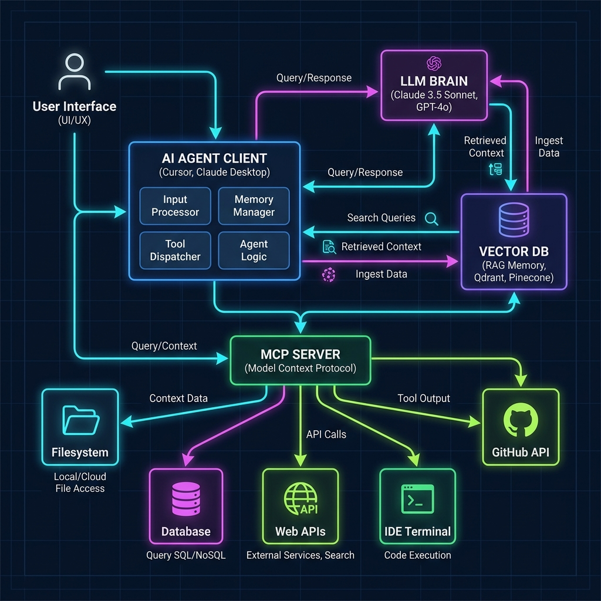

# AI Agent 概論

> [!ABSTRACT]
> 本篇筆記介紹人工智慧（AI）的演進、生成式 AI 與大語言模型（LLM）的基礎應用架構，並深入說明連接 AI 與外部資料、工具的關鍵橋樑 —— Model Context Protocol (MCP)。
>
> 💡 **快速連結**：[撰寫 Agent Prompt 的四大核心技巧](#72-撰寫-agent-prompt-的四大核心技巧)



---

## 1. 人工智慧 (AI) 與大語言模型 (LLM) 概述

隨著生成式 AI (Generative AI) 的快速發展，現代 AI 的應用核心已從傳統的「分類與預測」（如機器學習、深度學習）轉向「內容生成與推理」（如大語言模型 LLM）。

- **傳統 AI / 機器學習**：依賴特徵工程與特定模型，解決單一任務（如圖像辨識、銷售預測）。
- **現代生成式 AI / LLM**：透過海量參數的預訓練（Pre-training），具備通用的語言理解、推理與生成能力，並能藉由「工具調用（Tool Calling）」與現實世界互動。

---

## 2. 大語言模型應用架構 (LLM App Architecture)

在開發基於 LLM 的應用程式（如聊天機器人、AI 助理）時，標準架構通常包含以下幾個層次：

```
                    ┌──────────────────┐
                    │     User UI      │
                    └────────┬─────────┘
                             │
                    ┌────────▼─────────┐
                    │   Client/Agent   │ (如 Cursor, Claude Desktop)
                    └────────┬─────────┘
        ┌────────────────────┼────────────────────┐
        │                    │                    │
┌───────▼────────┐   ┌───────▼────────┐   ┌───────▼────────┐
│      LLM       │   │   Vector DB    │   │  Tools / APIs  │
│ (Gemini, GPT)  │   │  (RAG 知識檢索) │   │ (外部資料/操作) │
└────────────────┘   └────────────────┘   └────────────────┘
```

- **Client / Agent (用戶端/代理)**：應用的執行端，負責組裝 Prompts 並發送給 LLM。
- **LLM (大語言模型)**：大腦，負責推理、規劃與生成文字。
- **Vector DB (向量資料庫)**：提供外掛知識庫（RAG），解決 LLM 幻覺與時效性問題。
- **Tools / APIs (外部工具)**：讓 LLM 能做超出文字生成的事（如查天氣、執行程式碼、讀寫檔案）。

### 2.1 LLM 的無狀態本質與對話記憶機制

初學者常誤以為 LLM 會主動「記住」過去的對話，但實際上 **LLM 本身是無狀態的 (Stateless)**。每一次發送 API 請求時，模型都是一個全新啟動的大腦。

#### 1. 記憶是如何實現的？
為了讓用戶感覺到有「記憶功能」，**Client / Agent 必須在幕後主動管理對話狀態**。在用戶送出新訊息時，Client 會將歷史對話紀錄一同打包發送給 LLM：

```
[User sends "Hello"] ──> Client 發送: "User: Hello" ──> LLM
[LLM replies "Hi"]   ──> Client 記錄對話歷史

[User sends "Who am I?"] ──> Client 串接發送: "User: Hello \n Assistant: Hi \n User: Who am I?" ──> LLM
```

#### 2. 常見的記憶管理策略：
- **完整歷史串接 (Full History)**：將所有對話歷史全部送出。適用於短對話，但對話越長，消耗的 Token 越多，且會受到 LLM **上下文視窗 (Context Window)** 的限制。
- **滑動視窗 (Sliding Window)**：當對話超出長度限制時，Client 只保留最近的 $N$ 輪對話（如最近 5 次），捨棄過舊的歷史。
- **對話摘要 (Summary Memory)**：利用 LLM 定期將舊的對話進行摘要，並將摘要放入 System Prompt，在維持大意脈絡的同時節省 Token。
- **長期記憶與檢索 (Long-term Memory / RAG)**：將對話歷史或用戶偏好轉化為向量，存入資料庫。當用戶提問時，檢索出相關的歷史片段餵給 LLM（例如 AI 助理記住用戶的偏好或常用開發設定）。

### 2.2 AI 系統的安全防護：Guardrails (護欄)

當 AI Agent 具備操作外部工具與資料庫的權限時，安全性變得至關重要。**Guardrail (護欄)** 是設計在 LLM 應用程式外圍的安全控制機制，用以確保 AI 的輸入與輸出符合安全、合規與預期行為。

#### 1. 為什麼 Agent 需要 Guardrails？
如果沒有護欄，Agent 可能會因為**提示詞注入攻擊 (Prompt Injection)** 或模型本身的幻覺，而執行危險操作（例如：被引導刪除資料庫、寫入惡意程式碼、洩漏敏感用戶個資）。

#### 2. 常見的 Guardrails 實作層面：
- **輸入護欄 (Input Guardrails)**：在請求送達 LLM 之前，過濾用戶輸入。防止越獄（Jailbreak）或防範惡意指令注入。
- **輸出護欄 (Output Guardrails)**：在 LLM 產出回傳給用戶或送入工具前進行審查。
  - **格式校驗**：確保回傳的是合法的 JSON/XML（常用框架如 Guardrails AI、Pydantic）。
  - **內容過濾**：阻擋敏感詞彙、暴力、仇恨言論或虛假程式碼。
- **工具執行護欄 (Tool Call Guardrails & Human-in-the-loop)**：
  - **最小權限原則**：只給予 Agent 執行任務所需的最小工具權限（如唯讀）。
  - **人工介入確認 (Human-in-the-loop)**：針對高風險操作（如修改資料庫、發送扣款 API、執行 Terminal 指令），系統必須暫停並要求**人工點擊同意**後才可執行（這也是許多 AI 編輯器如 Cursor 的安全防護機制）。
  - **沙盒環境 (Sandboxing)**：程式碼執行等工具必須運行在隔離的沙盒環境中，防止影響主系統。

---

## 3. 什麼是 Model Context Protocol (MCP)？

**Model Context Protocol (MCP)** 是由 Anthropic 提出的開源協定，旨在標準化 **AI 應用程式 (Client)** 與 **資料來源及工具 (Server)** 之間的連接。

> [!NOTE]
> MCP 就像是 AI 時代的 **USB 接口** 或資料庫的 **ODBC/JDBC 驅動程式**。
> 過去每個 AI 工具（如 Cursor, Claude）要存取不同資料來源（如 GitHub, Postgres）都需要單獨開發整合程式；有了 MCP 後，只要雙方都支援 MCP 協定，就能即插即用。

---

## 4. MCP 的核心架構

MCP 採用 Client-Server 架構：

```
┌────────────────────────┐              ┌────────────────────────┐
│     MCP Host/Client    │              │       MCP Server       │
│                        │  Protocol    │                        │
│   (如 Cursor, Desktop)  ├─────────────►│ (如 Filesystem, SQLite) │
│                        │              │                        │
└────────────────────────┘              └───────────┬────────────┘
                                                    │
                                        ┌───────────▼────────────┐
                                        │  Data Sources / Tools  │
                                        └────────────────────────┘
```

- **MCP Host (Client)**：發起請求的 AI 整合環境，例如 Cursor、Claude Desktop、Zed 編輯器。
- **MCP Server**：輕量級服務，將本地資源或遠端 API 包裝成 MCP 規格暴露給 Client。
- **Data Sources / Tools**：實際被存取的資源，例如本地檔案系統、資料庫、GitHub API。

---

## 5. MCP 的三大核心功能 (Capabilities)

MCP 協定主要提供以下三種能力給 AI 應用：

### 5.1 Resources (資源)
- **定義**：**唯讀** 的資料來源，讓 Client 可以安全地將資料脈絡（Context）餵給模型。
- **範例**：讀取本地 Markdown 檔案、日誌檔（Log）、資料庫表格 Schema 等。

### 5.2 Prompts (提示詞模板)
- **定義**：預先設定好且參數化的提示詞模板，方便使用者快速調用。
- **範例**：`/review-code`、`/translate-to-english` 等帶有預設脈絡的指令。

### 5.3 Tools (工具)
- **定義**：**可執行** 的操作，允許模型在得到使用者授權後，對外部系統進行改動。
- **範例**：執行編譯指令（run command）、寫入檔案（write file）、在 GitHub 發起 Pull Request。

---

## 6. MCP 伺服器配置與設定 (MCP Config)

要讓 AI Client (如 Claude Desktop 或 Cursor) 能夠連接並調用 MCP Server，需要進行設定檔配置。

### 6.1 設定檔位置

不同主機環境與 Client 的設定檔路徑如下：

- **Claude Desktop App**:
  - **Windows**: `%APPDATA%\Claude\claude_desktop_config.json` (即可在檔案總管網址列輸入進入該資料夾)
  - **macOS**: `~/Library/Application Support/Claude/claude_desktop_config.json`
- **Cursor**:
  - 不需要手動編輯 JSON 檔案，可直接在 GUI 介面設定：
    `Settings (右上角齒輪) > Features > MCP` 點選 `+ Add New MCP Server`。

### 6.2 配置文件格式與範例

MCP 配置文件採用 JSON 格式，主要透過 `mcpServers` 欄位來定義多個 MCP Server。每個伺服器需指定執行命令 (`command`) 與對應的參數 (`args`)。

#### 範例 `claude_desktop_config.json`：

```json
{
  "mcpServers": {
    "filesystem": {
      "command": "npx",
      "args": [
        "-y",
        "@modelcontextprotocol/server-filesystem",
        "C:/Users/TMP-214/Desktop/Programming-Learning-Notes"
      ]
    },
    "sqlite": {
      "command": "uvx",
      "args": [
        "mcp-server-sqlite",
        "--db-path",
        "C:/Users/TMP-214/Desktop/Programming-Learning-Notes/sqlite.db"
      ]
    }
  }
}
```

#### 欄位說明：
- **`mcpServers`**：存放所有伺服器配置的主物件。
- **`filesystem` / `sqlite`**：自定義的 MCP Server 名稱。
- **`command`**：執行該伺服器所使用的指令（如 `npx`、`node`、`uvx`、`python` 或可執行檔路徑）。
- **`args`**：傳遞給指令的參數陣列。
  - `npx -y <package-name>`：自動下載並執行 Node.js 架構的 MCP Server。
  - `uvx <package-name>`：自動下載並執行 Python 架構的 MCP Server。

> [!IMPORTANT]
> 1. 修改設定檔後，必須**重啟** AI Client (如完全關閉並重新啟動 Claude Desktop) 才會生效。
> 2. 在 Windows 上設定路徑時，請使用正斜線 `/` 或雙反斜線 `\\` 以防 JSON 轉義字元解析錯誤。

---

## 7. 如何與 AI Agent 協作與撰寫 Prompt

與 AI Agent（具備工具使用能力的 AI）協作，其 Prompt 撰寫方式與傳統的聊天機器人（Chatbot）有所不同。你是在引導一個「行動者」，而非只是「回答者」。

### 7.1 Agent 的思考模式：ReAct 框架
Agent 通常遵循 **ReAct (Reasoning + Acting，推理與行動)** 的循環：
1. **Thought (思考)**：分析用戶需求，規劃下一步。
2. **Action (行動)**：選擇並執行工具（例如讀取某個檔案或查詢/寫入資料庫）。
3. **Observation (觀察)**：檢視工具執行的結果。
4. **Thought (思考)**：根據結果繼續規劃，直到解決問題。

### 7.2 ==撰寫 Agent Prompt 的四大核心技巧==

1. **賦予明確的角色與任務目標 (Role & Goal)**
   - **避免**：`幫我寫個網頁。`
   - **推薦**：`你是一位資深的前端工程師。請幫我建立一個具備 RWD 響應式設計的登入頁面，核心目標是讓載入時間小於 1 秒。`
2. **提供完整的背景脈絡與限制條件 (Context & Constraints)**
   - 告訴 Agent 它可以存取哪些資源，以及絕對不能做的事。
   - **範例**：`你可以讀取 src/utils 下的所有檔案。請使用 Python 內建標準庫，不要引入額外的第三方套件。`
3. **提供思維鏈引導 (Chain of Thought / CoT)**
   - 要求 Agent 在動手前先規劃步驟，能顯著提升複雜任務的成功率。
   - **範例**：`在修改程式碼之前，請先列出你的修改計劃，並分析此修改可能帶來的潛在風險。`
4. **Few-Shot Prompting (給予範例)**
   - 給予 1~2 個輸入與輸出範例，讓 Agent 了解你期望的格式或邏輯。

### 7.3 在開發工具 (如 Cursor / Claude) 中使用 Agent 的實務指引

- **善用上下文提及 (@ 語法)**：在 Cursor 或類似編輯器中，使用 `@Files` 或 `@Folders` 準確餵入相關代碼，避免 Agent 盲目搜尋。
- **學會漸進式開發 (Incremental Changes)**：不要一次丟一個超大任務。請將大任務拆解成小步驟（如：先寫單元測試 ➔ 實作功能 ➔ 重構），分步引導 Agent 執行。
- **審查差異 (Review Diffs)**：Agent 修改程式碼後，務必仔細審查 Git Diff，確認邏輯正確再接受（Accept），切勿盲目信任 Agent 的產出。
