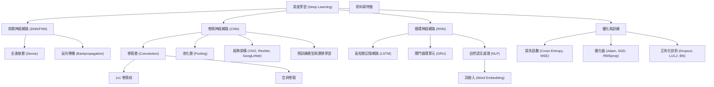

# 深度學習地圖 (Deep Learning Map)

> [!ABSTRACT]
> 本篇筆記為「深度學習 DL」系列筆記的導覽與地圖，梳理了從基礎神經網路、模型優化、卷積神經網路（CNN）到循環神經網路（RNN）的學習路徑，並提供核心模型（DNN、CNN、RNN）的橫向對比與知識圖譜。

---

## 一、 深度學習知識架構與學習路線

「深度學習 DL」系列筆記共有 18 篇，涵蓋了深度學習核心領域，建議讀者按照以下五個階段進行學習：

### 階段 1：深度學習基礎與工具
- **[[深度學習 DL/1.深度學習精要.md|1. 深度學習精要]]**：認識多層類神經網路的基本原理與反向傳播。
- **[[深度學習 DL/2.tensorflow.md|2. TensorFlow 基礎]]**：了解 TensorFlow 的低階運算與 Keras 高階 API 基礎操作。

### 階段 2：前饋神經網路 (DNN)
- **[[深度學習 DL/3.深度神經網路 DNN.md|3. 深度神經網路 DNN]]**：深入理解全連接層（FC）、神經元與前向傳播機制。

### 階段 3：模型訓練、優化與討論
- **[[深度學習 DL/4.訓練模型-損失函數.md|4. 損失函數]]**：介紹交叉熵、均方誤差等常用損耗評估。
- **[[深度學習 DL/5.優化算法.md|5. 優化算法]]**：學習梯度下降法、SGD、Adam、RMSprop 等權重更新演算法。
- **[[深度學習 DL/6.優化原理與神經網路驗證.md|6. 優化原理與驗證]]**：探討學習率調整、批次訓練（Batch）與驗證集評估。
- **[[深度學習 DL/7.神經網路技巧與討論.md|7. 神經網路技巧]]**：探討過擬合、正則化（L1/L2）、Dropout、Batch Normalization 等實務防錯機制。

### 階段 4：卷積神經網路 (CNN) - 影像處理主力
- **[[深度學習 DL/8.CNN神經網路介紹.md|8. CNN 神經網路介紹]]**：卷積、池化、局部感受野與 1x1 卷積核。
- **[[深度學習 DL/9.CNN網路建構.md|9. CNN 網路建構]]**：手把手利用 Keras 搭建經典的 LeNet-5 網路。
- **[[深度學習 DL/10.VGG神經網路與 Keras 訓練函數.md|10. VGG 網路]]**：學習小卷積核堆疊（VGG16）的經典架構。
- **[[深度學習 DL/11.GoogLeNet網路.md|11. GoogLeNet 網路]]**：解析並聯 Inception 模組與全域平均池化（GAP）。
- **[[深度學習 DL/12.ResNet網路.md|12. ResNet 網路]]**：深入殘差連接（Residual Block），解決深層網路退化問題。
- **[[深度學習 DL/13.預訓練模型、遷移學習.md|13. 預訓練模型與遷移學習]]**：善用 ImageNet 預訓練權重，透過特徵擷取與微調快速適應新任務。

### 階段 5：循環神經網路 (RNN) 與自然語言處理 (NLP)
- **[[深度學習 DL/14.Word representation介紹與Word Embedding實作.md|14. Word Representation & Embedding]]**：文字如何向量化（One-hot vs. Embedding）。
- **[[深度學習 DL/15.RNN網路介紹.md|15. RNN 網路介紹]]**：序列數據的時間循環與展開、SimpleRNN 實作。
- **[[深度學習 DL/16.LSTM 介紹.md|16. LSTM 介紹]]**：深入遺忘門、輸入門、輸出門，徹底解決長序列梯度消失。
- **[[深度學習 DL/17.GRU介紹.md|17. GRU 介紹]]**：LSTM 的精簡版本，僅用重置門與更新門即可緩解梯度消失。

---

## 二、 核心神經網路架構對比 (DNN vs. CNN vs. RNN)

為了幫助讀者在面對實務問題時能夠選擇最合適的網路結構，下方將全連接網路（DNN）、卷積網路（CNN）與循環網路（RNN）進行橫向對比：

| 比較項目 | 深度神經網路 (DNN / FNN) | 卷積神經網路 (CNN) | 循環神經網路 (RNN) |
| :--- | :--- | :--- | :--- |
| **英文全稱** | Deep Neural Network | Convolutional Neural Network | Recurrent Neural Network |
| **輸入資料類型** | 獨立的一維向量、特徵表格 | 二維圖像、網格結構資料 | 一維序列、時間序列、自然語言文本 |
| **核心結構** | 全連接層 (Fully Connected Layer) | 卷積層 (Convolutional)、池化層 (Pooling) | 循環單元 (RNN Cell / LSTM / GRU) |
| **權重特性** | 每個連接均有獨立權重，參數量大 | **局部感受野、權值共享** (二維空間共享) | **時間步權值共享** (所有時間步共用一套權重) |
| **記憶/時間關聯** | 無記憶，輸入之間互相獨立 | 無時間記憶，專注於空間局部特徵 | **具備記憶機制** (透過隱藏狀態 $h_t$ 傳遞歷史資訊) |
| **主要優點** | 結構簡單，理論上可逼近任何非線性函數 | 參數少、具平移不變性、善於捕捉空間局部特徵 | 適合處理變長序列、能捕捉時間前後上下文脈絡 |
| **主要缺點** | 無法保留空間與時間結構，參數量極易爆炸 | 計算量大，不適合處理具有前後順序的時間序列 | 易發生梯度消失/爆炸，計算時無法平行化（需按順序計算） |
| **典型應用場景** | 傳統機器學習分類/回歸預測、特徵整合 | 影像分類、目標檢測、影像分割、風格轉移 | 語音識別、機器翻譯、情感分析、文字生成 |

---

## 三、 深度學習技術圖譜 (Knowledge Graph)

