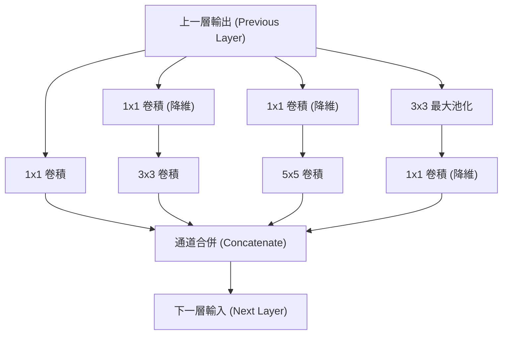

# 12. GoogLeNet 網路架構介紹

> [!ABSTRACT]
> 本章介紹 GoogLeNet（Inception v1）的核心思想與設計架構。為了解決加深網路帶來的過擬合與梯度消失問題，GoogLeNet 引入了 Inception 模組（加寬網路）、1x1 卷積降維、輔助分類器以及全域平均池化（GAP），以更少的參數量達到更高的辨識準確率。

---

## 一、 GoogLeNet 的設計核心與動機

在傳統 CNN 中，要提升模型性能最直接的做法是**增加網路的深度（層數）與寬度（通道數）**，但無限制地加深加寬會帶來以下嚴重問題：
1. **參數量爆炸**：模型參數量過多，在有限的訓練資料下極易產生**過擬合 (Overfitting)**。
2. **梯度消失/彌散**：網路過深時，反向傳播計算出的梯度在傳回前幾層時會趨近於零，導致模型難以收斂。
3. **計算資源消耗大**：深層網路需要極高的算力，實務上難以部署。

**GoogLeNet 的解決方案**：
- **深度（22層）**：為了解決深層網路的梯度消失問題，GoogLeNet 在中間層設計了**兩個輔助分類器 (Auxiliary Classifiers)** 來輔助收斂。
- **寬度 (Inception 結構)**：在同一個層級中並聯使用多種不同大小的卷積核與池化，加寬網路對不同尺度特徵的提取能力。

---

## 二、 Inception 模組結構 (Inception Module)

Inception 結構的核心想法是「並聯不同卷積核，最後進行通道合併（Concatenate）」。

- **Concatenate (通道合併)**：這是一種通道維度上的拼接（例如一個 $28 \times 28 \times 64$ 與一個 $28 \times 28 \times 128$ 的特徵圖拼接後變為 $28 \times 28 \times 192$）。這意味著描述影像特徵的維度（通道數）增加了，但特徵圖的長寬大小保持不變。

### 1. 原始 Inception 結構的問題
直接在輸入端並聯 $1 \times 1$、$3 \times 3$、$5 \times 5$ 卷積與 $3 \times 3$ Max Pooling，會使得特徵圖的厚度（通道數）越疊越厚，加上大卷積核的運算，會導致**參數量與計算量過於龐大**。

### 2. 降維版 Inception 結構 (Inception v1)
為了解決計算量問題，GoogLeNet 引入了 **1x1 卷積核** 作為**瓶頸層 (Bottleneck)** 來進行降維（藉由設定較少的 Filter 數量減少輸出通道數）。

---

## 三、 Inception V1 的四大特點

### 1. 增加網路廣度（多重卷積核）
在同一個 Inception 模組中，同時並聯使用 $1 \times 1$、$3 \times 3$、$5 \times 5$ 的卷積核，這使得網路能同時提取影像中不同空間尺度（小細節至大區域）的特徵。

### 2. 引入 1x1 卷積層降維
在運算開銷較大的 $3 \times 3$、 $5 \times 5$ 卷積前，以及最大池化後，先接一個 $1 \times 1$ 卷積限制通道數量，從而極大地降低了模型的運算複雜度。

### 3. 以全域平均池化 (GAP) 替代全連接層 (FC)
傳統 CNN（如 AlexNet、VGG）在卷積層結束後，會連接數個神經元數量極多的全連接層（FC），這些 FC 層的參數量通常佔了整個網路的 **80%**，非常容易造成過擬合。
- **GoogLeNet 的改進**：採用**卷積層 + 全域平均池化 (GAP)** 的組合來取代傳統全連接層。
- **特點**：全域平均池化本身**不具有任何待學習的參數**，因此能顯著降低模型參數量、加快訓練速度並抑制過擬合。

### 4. 中間層使用輔助分類器 (Auxiliary Classifiers)
為了解決 22 層網路在訓練時產生的梯度消失問題，GoogLeNet 在網路的中間段分支處增加了兩個輔助分類器。
- **運作機制**：在訓練階段，這兩個輔助分類器的損失（Loss）會乘以 **0.3** 的權重，然後加到最終的總損失函數中進行反向傳播。
- **作用**：強迫中間層也輸出具備分類能力的特徵，提供額外的梯度流，有助於網路的穩定收斂與正則化（可以看作是一種 Ensemble 整合學習效果）。而在預測/推論階段，這兩個輔助分類器會被拿掉。

---

## 四、 全域平均池化 (Global Average Pooling, GAP) 運作原理

假設我們正在處理一個影像分類任務，最終需要分出 10 個類別：
1. 最後一個卷積層的輸出通道數（Filter 數量）必須設定為 **10**，即輸出 10 張特徵圖（Feature Maps）。
2. **GAP 運算**：針對每一張特徵圖，計算圖中所有像素點數值的**平均值**。
3. 最終這 10 張特徵圖經過平均後，會直接縮減得到 **10 個數值**（一維向量）。
4. 將這 10 個數值直接輸入到 Softmax 層中，即可得到屬於這 10 個類別的概率值。

> [!NOTE]
> **為什麼可以這樣做？**
> 因為經過多層特徵提取後，最後的這 10 張特徵圖中每一張都代表了該影像與特定類別特徵的「相似度地圖」。對整張圖求平均值，實務上就代表了該影像與該類別的整體相似程度。