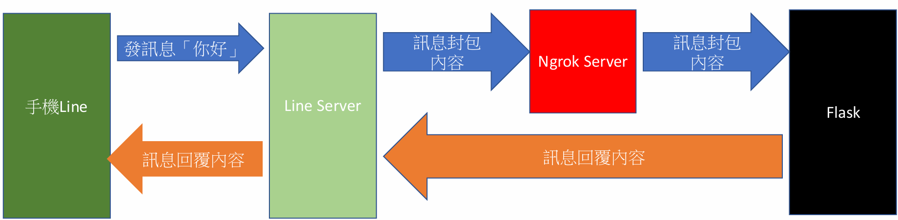

# LINE Bot 聊天機器人應用

> [!ABSTRACT]
> 本篇筆記整理從零開始申請與設定 LINE Messaging API 的步驟、利用 ngrok 進行本地穿透以進行本機偵錯，並部署基礎「鸚鵡答應機」聊天機器人的實作流程。

---

## 一、 申請 LINE Bot

在 LINE 系統中，不同的服務與應用程式是透過 **Channels** 進行區隔管理。

1. **進入 LINE Developers**：前往 [LINE Developers Console](https://developers.line.biz/)。
2. **登入 Console**：點選右上角，使用個人的 LINE 帳號登入。
3. **建立 Provider**：點選 `Create a new provider`（Provider 代表提供服務的公司或個人）。
4. **建立 Messaging API Channel**：點選 `Create a Messaging API channel`。
5. **建立官方帳號**：依據欄位填寫基本資料。目前開發 LINE 機器人皆必須與 LINE 官方帳號進行連動綁定。
6. **選擇 Messaging API**：在官方帳號管理後台 (Official Account Manager) 中，確認選用 Messaging API。
7. **啟用 Messaging API**：點選 `Create a Messaging API`（註：若服務涉及金流或商業行為，必須提供隱私權政策與服務條款）。
8. **返回開發者後台**：設定完成後，後續的進階管理可回到 LINE Developers Console 進行。

---

## 二、 設定 Messaging API

在 LINE Developers Console 中，需注意並設定以下幾個核心項目：

1. **Channel Access Token**：
   - 這是機器人的 API 存取憑證。
   - 點選 **Issue** 後即可顯示。若日後需要重置，可使用 **Reissue**。
2. **Security Settings**：
   - 可設定允許調用 API 的 IP 位址白名單。非白名單內的 IP 位址將無法向 LINE 發送管理或推送訊息。
3. **Roles**：
   - 可在此新增其他協同開發者 or 管理者。

---

## 三、 使用 ngrok 進行本地端偵錯

**ngrok** 是一套可以快速將本機服務暴露至公網的穿透工具，免去配置固定 IP、連接埠 (Port) 轉發與網域 (Domain) 的繁瑣程序。

1. **下載與安裝**：安裝 ngrok 後，在終端機輸入官網給予的授權 Token 進行驗證：
   ```bash
   ngrok config add-authtoken <Your_Authtoken>
   ```
2. **啟動轉發**：輸入以下指令以轉發指定的連接埠（Port），即可獲得一組 `https` 開頭的臨時公開網址：
   ```bash
   ngrok http <Port號碼>
   ```

---

## 四、 鸚鵡答應機實作

本實作使用 Python Flask 與 LINE Bot SDK（以 `app.py` 的 `/callback` 路由為核心）。

1. **設定金鑰 (config.ini)**：
   在設定檔中填入從 LINE Developers Console 取得的 `channel_access_token` 與 `channel_secret`。
2. **配置 Webhook URL**：
   - 複製 ngrok 產生的 `https` 網址，加上 `/callback` 後綴（例如：`https://xxxx.ngrok-free.app/callback`）。
   - 將此網址填入 LINE Developers Console 的 **Webhook URL** 欄位中，並點選 **Verify** 確保連線測試為 **Success**。
3. **開啟 Webhook 功能**：
   在 Messaging API 設定頁面中，務必將 **Use webhook** 功能開啟。
4. **功能測試**：
   此時以手機傳送文字訊息給官方帳號，官方帳號將會原封不動地回傳相同文字（即「鸚鵡答應機」）。

