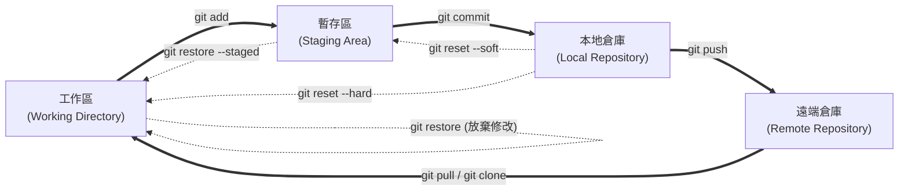

# Git 常用指令與實務指引

> [!ABSTRACT]
> 本章整理版本控制工具 Git 的核心概念與常用命令速查表，涵蓋環境設定、本地版控工作流、分支管理、遠端協作以及版本回退等常用實務操作。

---

## 一、 Git 初始化與基礎設定

在開始使用 Git 進行版本控制前，需進行基本的使用者身分設定。

### 1. 使用者身分設定
```bash
# 設定全域使用者名稱
git config --global user.name "YourName"

# 設定全域電子郵件
git config --global user.email "your_email@example.com"

# 查看當前所有 Git 設定
git config --list
```

### 2. 建立與複製倉庫
```bash
# 在當前目錄初始化一個新的本地 Git 倉庫（建立 .git 資料夾）
git init

# 複製一個遠端的 Git 倉庫到本地
git clone <遠端倉庫URL>
```

---

## 二、 本地版控基礎工作流

本地版控流程通常在：**工作區 (Working Directory)** ➔ **暫存區 (Staging Area)** ➔ **本地倉庫 (Local Repository)** 之間進行。



| 指令                          | 說明                               |
| :-------------------------- | :------------------------------- |
| `git status`                | 檢查當前工作區與暫存區的檔案狀態（新增、修改、刪除）       |
| `git add <file>`            | 將指定檔案的變更加入暫存區                    |
| `git add .`                 | ==將當前目錄下所有修改與新增的檔案一次性加入暫存區==     |
| `git commit -m "msg"`       | ==將暫存區的變更提交到本地倉庫，並附上提交訊息==       |
| `git commit -am "msg"`      | 直接將所有「已追蹤並修改」的檔案加入暫存並提交（不適用於新檔案） |
| `git diff`                  | 查看工作區與暫存區之間的代碼差異                 |
| `git log`                   | 查看詳細歷史提交紀錄                       |
| `git log --oneline --graph` | 以單行與圖形化線條簡潔呈現分支歷史紀錄              |

### 1. git commit 指令進階細節

> [!TIP]
> **直接輸入 `git commit`（未帶 `-m` 參數）的行為與操作**
>
> 若在終端機中直接執行 `git commit`，Git 會自動開啟預設的終端機文字編輯器（在 Linux/Mac 通常為 Vim 或 Nano，Windows 通常為 Vim）要求您輸入 Commit 訊息：
>
> 1. **編輯 Commit 訊息**：
>    - **Vim 操作**：進入時為「命令模式」，請按鍵盤上的 **`i`** 進入「編輯模式（INSERT）」，此時可開始輸入文字。建議格式為：第一行寫簡短標題，空一行，第三行起寫詳細的修改內容說明。
>    - **儲存並離開**：輸入完畢後，按 **`Esc`** 退出編輯模式回到命令模式，接著輸入 **`:wq`** 並按下 **`Enter`** 即可完成存檔並提交。
>    - **取消本次提交**：若不想提交，按 **`Esc`** 回到命令模式，輸入 **`:q!`** 並按下 **`Enter`**（或是不輸入任何內容直接存檔離開），Git 會顯示 `Aborting commit due to empty commit message` 並取消本次提交。
> 2. **更換預設編輯器**（例如改用 VS Code）：
>    ```bash
>    git config --global core.editor "code --wait"
>    ```

---

## 三、 分支管理與切換 (Branching)

分支是 Git 的核心功能，讓開發者能平行開發不同功能而互不干擾。

| 指令                       | 說明                                         |
| :----------------------- | :----------------------------------------- |
| `git branch`             | 列出本地所有分支，並標註當前所在分支                         |
| `git branch -a`          | 列出本地與遠端的所有分支                               |
| `git branch <name>`      | ==建立一個名為 `<name>` 的新分支（但不切換）==             |
| `git checkout <name>`    | ==切換至指定分支（新版本推薦使用 `git switch <name>`）==   |
| `git checkout -b <name>` | 建立新分支並立即切換過去（新版本推薦 `git switch -c <name>`） |
| `git merge <name>`       | 將指定的 `<name>` 分支代碼合併到「當前所在分支」              |
| `git branch -d <name>`   | 刪除已合併的本地分支                                 |
| `git branch -D <name>`   | 強制刪除未合併的本地分支                               |

---

## 四、 遠端倉庫協作 (Remote)

用於本地倉庫與 GitHub / GitLab 等遠端伺服器的同步協作。

| 指令                            | 說明                                             |
| :---------------------------- | :--------------------------------------------- |
| `git remote -v`               | 查看當前連結的遠端倉庫地址與名稱（通常預設為 `origin`）               |
| `git remote add origin <URL>` | 將本地倉庫連結至指定的遠端倉庫地址                              |
| `git push -u origin <branch>` | 將本地分支推送到遠端，並設定預設追蹤（後續只需打 `git push`）           |
| `git push`                    | ==將本地提交推送到已綁定追蹤的遠端分支==                         |
| `git fetch`                   | ==從遠端拉取最新的變更紀錄，但不自動合併到本地工作分支==                 |
| `git pull`                    | ==從遠端拉取最新代碼並「自動合併」至當前本地分支（相當於 fetch + merge）== |

### 1. git push 參數與推動規則

當我們想將本地變更推送至遠端伺服器時，主要有以下三種常用指令形式，其運作規則如下：

#### 💡 `git push origin <分支名稱>` (例如 `git push origin main`)
- **行為**：明確指定要將本地變更推送到遠端倉庫（`origin`）的特定分支（`main`）。
- **特點**：這是一次性的推動指令，**不會**在本地與遠端分支之間建立長期的追蹤關係。如果下次直接輸入 `git push`，Git 依然不知道預設要推送到哪裡。

#### 💡 `git push -u origin <分支名稱>` (例如 `git push -u origin main`)
- **行為**：推送的同時，使用 `-u`（或 `--set-upstream`）在本地分支與遠端的 `origin/main` 之間**建立預設追蹤（Upstream）連結**。
- **適用場景**：**第一次將新分支推送到遠端時使用**。設定好後，未來在此分支下只需輸入極簡的 `git push` 或 `git pull`，Git 就會自動對應到遠端的 `origin/main`，無須再輸入完整路徑。

#### 💡 `git push` (無任何參數)
- **行為**：將當前分支的變更推送至其對應的「已追蹤遠端分支」。
- **限制**：只有在當前分支已使用 `-u` 建立過追蹤連結時才有效。若未設定追蹤即直接執行 `git push`，Git 會報錯並提示需要指定遠端與分支，或是使用 `--set-upstream`。

---

## 五、 復原與衝突解決 (Undo & Conflict)

當發生錯誤或程式碼衝突時，使用以下指令進行回退或修正。

### 1. 修改撤銷與復原

| 指令 | 說明 |
| :--- | :--- |
| `git restore <file>` | 放棄工作區中未暫存的修改（還原到最近一次 commit 或暫存狀態） |
| `git restore --staged <file>` | 將檔案從暫存區移回工作區（等同於取消 `git add`） |
| `git commit --amend` | 修改最後一次的 commit 訊息或追加檔案至最近一次 commit |
| `git reset --soft HEAD~1` | 撤銷最近一次 commit，但保留工作區與暫存區的修改代碼（安全回退） |
| `git reset --hard HEAD~1` | 撤銷最近一次 commit，且**徹底丟棄**該次 commit 以後的所有代碼修改 |
| `git reset --hard <commit_id>`| 將本地倉庫強制回退至指定的歷史 commit 版本 |
| `git revert <commit_id>` | 以新增一個 commit 的方式來撤銷指定 commit 的修改（適用於已 push 的歷史） |

### 2. 衝突解決
當合併分支（如 `git merge`）時，若兩分支修改了同一個檔案的同一行，會產生衝突：
1. Git 會在檔案中插入衝突標記：
   ```text
   <<<<<<< HEAD
   當前分支的程式碼
   =======
   要被合併分支的程式碼
   >>>>>>> branch-name
   ```
2. **手動編輯**檔案，決定保留哪一部分並刪除衝突標籤。
3. 修改完畢後，執行暫存與提交以完成合併：
   ```bash
   git add <衝突檔案>
   git commit -m "Fix merge conflict"
   ```
