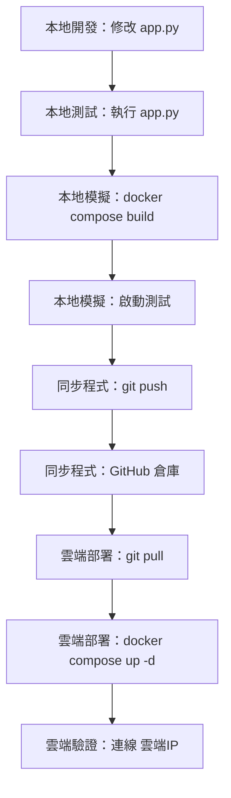

# 開發、測試與部署流程

本文件展示了從「本地開發」、「本地 Docker 模擬」到「推送到 GitHub」並在「雲端部署」的完整開發與部署生命週期流程。

### 流程說明：

1. **本地開發與測試 (Local Development & Test)**
   * 在本機修改 `app.py` 後，直接在本地啟動 Python 程式執行。
   * 此時程式會連線到在本地映射的 MySQL `localhost:8625`，便於快速除錯與修改。

2. **本地 Docker 模擬 (Local Docker Simulation)**
   * 本地功能驗證無誤後，使用 `docker compose build` 或 `docker compose up -d --build` 於本地模擬容器化環境。
   * 確保 `app.py` 成功打包，且能透過 `mysql.cki101:3306` 與資料庫進行容器內部的通訊。

3. **程式碼同步 (Git Sync)**
   * 本地容器模擬確認正常後，使用 `git push` 將代碼發布至 GitHub 儲存庫。

4. **雲端部署與驗證 (Cloud Deployment & Verification)**
   * 在雲端虛擬機 (VM) 上以 `git pull` 拉取最新程式碼。
   * 執行 `docker compose up -d --build` 重建映像檔並啟動服務，隨後便可由外部瀏覽器連線至雲端 IP 進行最終驗證。
